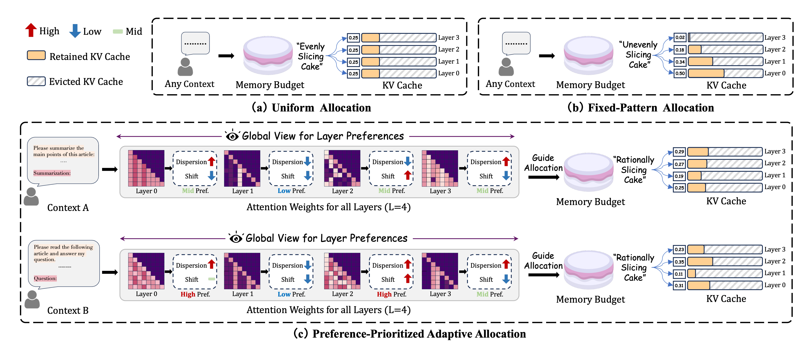

# CAKE: Cascading and Adaptive KV Cache Eviction with Layer Preferences

> [!NOTE]
> 通过熵和方差来分配每一层的KVCache预算和计算token的驱逐指标。

1. 引言：现有KV Cache方法的局限性
- **背景**：大型语言模型（LLM）在处理长序列时，对键值缓存（key-value, KV cache）的需求激增。
- **问题**：尽管近期的KV cache驱逐（eviction）方法减轻了推理负担，但它们通常无法根据具有不同注意力模式（attention patterns）的层（layer）来合理分配资源。

2. CAKE：一种新颖的KV Cache驱逐框架
- **方法全称**：Cascading and Adaptive KV cache Eviction (CAKE)。
- **核心思想**：将KV cache驱逐问题构建为一个“蛋糕切分问题”（cake-slicing problem）。
- **目标**：实现对cache分配的全局审视，在严格的内存预算内，自适应地为不同层级的注意力机制分配资源。

3. CAKE的核心机制与创新
- **层级偏好评估**：通过同时考虑注意力动态的空间（spatial）和时间（temporal）维度，来评估每个层（layer）的特定偏好。
- **级联式（Cascading）内存管理**：
    1. 根据评估出的层级偏好，为各层分配合理的cache大小。
    2. 以级联的方式管理内存约束。
- **新的驱逐指标**：
    - 采用一种新的驱逐指标，该指标考虑了token重要性随时间推移而发生的变化。
    - 解决了现有方法忽略时间动态（temporal dynamics）的局限性。

4. 实验与评估结果
- **测试平台**：在LongBench和NeedleBench上进行了全面的实验。
- **主要性能表现**：
    - **高压缩率**：仅使用3.2%的KV cache即可维持模型原有性能。
    - **性能超越**：在多种模型和内存限制下，其性能稳定优于当前的baseline方法，尤其是在低内存场景下。
    - **显著加速**：当使用FlashAttention-2处理128K token的上下文时，与全量cache相比，CAKE在解码延迟（decoding latency）上实现了超过10倍的加速。

## Introduction

1. **引言与动机**
- **背景**: 大型语言模型（LLM）在长文本处理能力上已有显著提升，扩展的上下文窗口（如超过128K token）带来了新的挑战。
- **核心问题**: 随着上下文增长，Key-Value (KV) cache 的大小呈线性增加，导致推理时内存负担加重。
- **现有方法的局限性**:
    - **训练阶段优化**: 在训练中合并KV-head等方法需要重新训练模型，不适用于模型结构固定的部署场景。
    - **动态KV对移除**:
        - **统一缓存大小**: 现有方法通常为所有层分配相同的缓存大小，忽略了各层的特定需求，在内存受限时会损害性能。
        - **依赖先验观察**: 基于对不同层注意力模式的先验观察进行分配，可能无法泛化到所有输入类型和模型。
        - **基于当前注意力**: 根据当前注意力模式调整缓存大小，但可能无法实现全局最优性能。

2. **问题分析：KV缓存分配的挑战**
- **“切蛋糕”比喻**: 在固定的总内存预算下，为不同层分配最优的缓存大小，如同“切蛋糕”。关键在于评估每层对KV cache的“亲和力”（affinity）。
- **注意力机制的层级差异**:
    - **空间维度 (Spatial)**: 不同层的注意力分布模式迥异。有些层注意力分散，覆盖范围广；有些层则高度集中于特定token。
    - **时间维度 (Temporal)**: 某些层的注意力热点会随时间推移而变化，而其他层则保持相对稳定。
- **现有分配策略的不足**:
    - **统一分配 (Uniform)** 和 **固定模式分配 (Fixed-pattern)** 缺乏灵活性，无法适应注意力机制的动态变化。
    - 传统方法仅依赖静态的空间注意力分数来驱逐KV对，忽略了注意力的时间演变，错失了关键信息。

3. **CAKE方法：级联自适应KV缓存驱逐**
- **方法全称**: Cascading and Adaptive KV cache Eviction (CAKE)。
- **核心组成**:
    1.  **偏好优先的自适应缓存分配策略 (Preference-prioritized adaptive cache allocation)**。
    2.  **创新的Token驱逐策略 (Token eviction strategy)**。
- **关键技术细节**:
    - **层级偏好度量**: 提出一种新的度量标准，通过同时考虑**空间注意力的分散度**和**时间注意力的变化**，来评估每层对缓存大小的偏好。
    - **级联缓存管理 (Cascading cache management)**:
        - 在**预填充 (prefilling) 阶段**，根据计算出的层级偏好分数，动态管理各层的内存预算并调整KV cache。
        - 这种方法无需为所有层存储全部的KV cache，从而在不牺牲驱逐性能的前提下，达到与统一策略相当的内存使用效率。
    - **新的驱逐指标 (Eviction indicator)**:
        - 针对Token驱逐，引入一个新指标，该指标综合考虑了Token的**持续重要性 (sustained importance)** 和**注意力可变性 (attention variability)**。
        - 目标是最小化驱逐操作对后续解码步骤的负面影响。

4. **实验与贡献**
- **实验设置**:
    - **模型**: 多种LLM架构。
    - **Benchmark**: LongBench 和 NeedleBench。
    - **任务**: 涵盖九大类任务。
- **主要成果**:
    - CAKE在不同内存限制场景下均表现出卓越性能。
    - 与全缓存的FlashAttention-2实现相比，CAKE显著降低了内存消耗，同时提升了LLM的吞吐量。
    - CAKE的分配策略具有通用性，可以作为现有KV缓存驱逐方法的补充和增强。
- **核心贡献总结**:
    1.  通过分析注意力的空间分散性和时间变化，提出了一种评估层级缓存需求的度量方法。
    2.  设计了一种基于层级偏好的自适应缓存分配策略，以优化整体缓存利用。
    3.  提出一种级联缓存管理方法，在预填充阶段动态调整KV cache，实现高效内存利用。
    4.  引入一个新的驱逐指标，综合考虑Token的持续重要性和可变性，提升了Token驱逐性能。

## Related works

1.  **KV Cache Eviction 概述**
    *   **目的**：在模型推理过程中，通过策略性地减少 KV cache 来提升计算效率，同时不改变 attention 机制。

2.  **早期方法：基于位置的驱逐策略**
    *   **核心思想**：关注输入序列的特定部分进行驱逐。
    *   **代表方法**：StreamingLLM, LM-Infinite。
    *   **具体策略**：优先保留序列的初始（first）和最新（last）的 tokens。
    *   **局限性**：存在忽略序列中间部分重要 tokens 的风险。

3.  **改进方法：基于 Attention 指标的过滤**
    *   **核心思想**：引入更复杂的指标来筛选和过滤不必要的 KV cache 条目。
    *   **指标示例**：
        *   累积 attention 分数
        *   最后一个 token 的 attention 分数
        *   平均 attention 分数
        *   对近期 attention 分数进行聚类
    *   **局限性**：这些方法虽然更精细，但通常采用统一的缓存分配策略（uniform allocation strategy），未能最大化缓存利用率。

4.  **缓存分配策略的演进**
    *   **核心思想**：从“驱逐哪些 token”转向“如何分配缓存预算”。
    *   **不同方法的策略**：
        *   **FastGen**：根据特殊标记决定保留哪些 tokens，但未限制总缓存大小。
        *   **PyramidInfer & PyramidKV**：以金字塔形的方式分配缓存预算。
        *   **D2O**：根据当前层的 attention 密度（density）动态调整缓存大小。
    *   **共同局限性**：
        *   依赖于预定义的、跨所有层（layer）统一的分配策略。
        *   或仅基于局部层的 attention 信息，缺乏对层级缓存偏好的全局视角（global perspective）。

5.  **本文工作：全局视角的层级偏好**
    *   **出发点**：解决现有方法的局限性。
    *   **核心贡献**：从一个全面且全局的视角，考虑并结合了不同层（layer-specific）对缓存的特定偏好。

## Insights into attention dynamics

1.  **引言与背景**
    *   **研究动机**: 近期研究表明，在 `token` 解码过程中，只有少数 KVcache 元素是至关重要的。
    *   **核心概念**: 本文基于此识别出两个关键的注意力特性：
        *   **空间注意力分散度 (Spatial Attention Dispersion)**: 单个 `token` 的注意力如何在其他 `token` 间分布。
        *   **时间注意力转移 (Temporal Attention Shift)**: 被高度关注的 `token` 如何随时间演变。

2.  **注意力动态分析方法**
    *   **分析基础**: 基于 `decoder-only` 模型中的注意力权重矩阵 $\mathbf{A}$，其中 $\mathbf{A}[i, j]$ 表示第 $i$ 个查询 `token` 对第 $j$ 个键 `token` 的关注程度。
    *   **空间分析 (Spatial Analysis)**:
        *   **分析对象**: 矩阵的行 $\mathbf{A}[i, :]$。
        *   **含义**: 展示在单个生成步骤中，第 $i$ 个 `token` 的注意力在所有 `token` 上的分布情况，揭示模型如何确定信息优先级。
    *   **时间分析 (Temporal Analysis)**:
        *   **分析对象**: 矩阵的列 $\mathbf{A}[:, j]$。
        *   **含义**: 展示对第 $j$ 个 `token` 的关注度如何随时间（即生成步骤）变化，用于追踪模型注意力的动态转移。

3.  **注意力特性的量化**
    *   **空间注意力分散度 (Spatial Attention Dispersion)**:
        *   **量化指标**: 使用 $\mathbf{A}[i, :]$ 的熵（Entropy）来衡量。
        *   **计算公式**: $\text{H}(\mathbf{A}) = - \sum_{i=0}^{S-1} \mathbf{A}[i, :] \log (\mathbf{A}[i, :])^T$
        *   **指标解读**: 高熵值表示注意力分布均匀，低熵值表示注意力集中。
    *   **时间注意力转移 (Temporal Attention Shift)**:
        *   **量化指标**: 使用 $\mathbf{A}[:, j]$ 的方差（Variance）来衡量。
        *   **计算公式**: $\text{V}(\mathbf{A}) = \sum_{j=0}^{S-1} \text{Var}(\mathbf{A}[:, j])$
        *   **指标解读**: 高方差值表示注意力发生显著转移，低方差值表示注意力稳定。

4.  **实验分析与结论**
    *   **实验设置**: 使用 LongBench 数据集中的长上下文样本，分析多个 LLM 不同层的注意力动态。
    *   **核心发现**: 空间注意力的分散度和时间注意力的转移在不同层、不同模型和不同上下文中表现出显著差异。
    *   **结论与启示**: 这些发现揭示了 LLM 注意力机制的复杂性和动态性，表明需要为 KVcache 设计量身定制的管理策略，以有效应对注意力的动态变化。

## Methods

### 偏好优先的自适应分配策略 (Preference-Prioritized Adaptive Allocation Strategy)

该策略旨在解决因注意力机制在不同层、模型和上下文中的可变性而导致的固定缓存分配策略效率低下的问题，尤其是在内存预算有限的情况下。

1.  **核心思想**
    *   从注意力模式的全局视角出发，考虑每个层的独有特性。
    *   自适应地为每一层分配 KV cache 大小。

2.  **偏好度量 (Preference Metric)**
    *   **定义**：为量化每个注意力层的 KV cache 需求，引入了一个偏好度量 $P$，它综合考虑了注意力的空间离散度（spatial dispersion）和时间偏移（temporal shift）。
    *   **计算公式**：$P = \mathcal{H}^{\frac{1}{\tau_1}} \cdot \mathcal{V}^{\frac{1}{\tau_2}}$
    *   **公式组成**：
        *   **空间离散度 $\mathcal{H}$**：通过 $\mathcal{H} = \text{H}(A[-S_w :, : -S_w])$ 计算。高 $\mathcal{H}$ 值表示注意力模式分散，需要保留更广泛的上下文。
        *   **时间偏移 $\mathcal{V}$**：通过 $\mathcal{V} = \text{V}(A[-S_w :, : -S_w])$ 计算。高 $\mathcal{V}$ 值表示注意力模式频繁变化，需要支持复杂的时序模式。
        *   **分析窗口**：计算集中于注意力矩阵 $A$ 的一个近期窗口 $A[-S_w :, : -S_w]$，窗口大小为 $S_w$。这种方法能有效捕捉近期查询的解码模式。
        *   **温度参数 $\tau_1, \tau_2$**：用于调整空间离散度和时间偏移对最终偏好得分 $P$ 的影响权重，以适应不同模型和内存限制。
    *   **作用**：偏好得分 $P$ 越高的层，从更大的 KV cache 中获益越多，性能提升更明显。

3.  **自适应分配实现**
    *   **动态调整**：利用层特定的偏好得分 $P_l$ 来动态适应不同模型和上下文。
    *   **分配方法**：通过对所有层的偏好得分进行归一化，然后按比例分配总的缓存预算 $B_{\text{total}}$。
    *   **分配公式**：每层 $l$ 的自适应缓存大小 $B_l$ 计算如下：
    $$
    B_l = \frac{P_l}{\sum_{k=0}^{L-1} P_k} \cdot B_{\text{total}}
    $$
    *   **最终效果**：该方法根据每层的独有特性和当前输入上下文，优化了 KV cache 的分配。

### 偏好引导的级联缓存管理 (Preference-guided Cascading Cache Management)

1.  **问题背景：初始策略的内存瓶颈**
    *   初始的“偏好优先自适应分配策略”（preference-prioritized adaptive allocation strategy）虽然最优，但要求在预填充（prefilling）阶段对所有层的注意力权重有一个全面的视图。
    *   这导致了峰值内存使用量达到 $\mathcal{O}(S \cdot L)$，可能会超出总缓存预算 $B_{\text{total}}$。

2.  **解决方案：偏好引导的级联缓存管理 (Preference-guided Cascading Cache Management)**
    *   **核心思想**：在 prefilling 过程中动态维护缓存预算，从而将峰值内存使用量有效降低到目标水平。
    *   **算法流程**（Algorithm 1）：
        1.  **分阶段处理**：将 prefilling 过程划分为 $L$ 个阶段，每个阶段对应一个模型层。
        2.  **动态预算分配**：在每个阶段 `m`，当新的一层完成其 prefilling 计算后，根据当前已获得的偏好分数（preference scores）在所有已处理的层（0 到 `m`）中重新分配总预算 $B_{\text{total}}$。
        3.  **缓存更新**：根据重新分配的预算，更新所有已处理层的 KV cache。
    *   **主要优势**：在 prefilling 阶段保持恒定的内存使用，同时其最终的缓存分配和驱逐结果与标准策略等效。

3.  **理论保证**
    *   **命题1 (Proposition 1): 预算单调递减**
        *   **内容**：对于任意层 $l$，从阶段 $l$ 到 $L-1$，分配给该层的预算大小 $B_l^{(m)}$ 是单调递减的。
        *   **公式**：$B_l^{(m+1)} < B_l^{(m)}, \, m \in [l, L-1]$。其中，预算 $B_l^{(m)}$ 的计算方式为 $B_l^{(m)} = \frac{\mathcal{P}_l}{\sum_{k=0}^m \mathcal{P}_k} \cdot B_{\text{total}}$。
        *   **意义**：保证了在后续阶段中，每层的 KV cache $\{\mathbf{K}_l, \mathbf{V}_l\}^{(m+1)}$ 总是前一阶段缓存 $\{\mathbf{K}_l, \mathbf{V}_l\}^{(m)}$ 的一个真子集，使得缓存驱逐操作可以稳定执行。

    *   **定理1 (Theorem 1): 级联驱逐的等效性**
        *   **关键操作定义**：
            *   **指示向量 (Indicator vector)** $\mathbf{I}_l$：用于衡量第 $l$ 层中 token 的重要性。
            *   **驱逐操作 (Eviction operation)** $\text{EVICT}(\cdot)$：根据指示向量的分数，从当前缓存中保留得分最高的 top-$K$ 个 KV 对。
        *   **内容**：对于任意层 $l$，从阶段 $l$ 到 $L-1$ 通过级联驱逐（cascading eviction）得到的最终 KV cache，与在完整的 KV cache 上使用最终计算出的预算 $B_l$ 进行一次性驱逐的结果是等效的。
        *   **公式**：$\{\mathbf{K}_l, \mathbf{V}_l\}^{(L-1)} = \text{EVICT}(\{\mathbf{K}_l, \mathbf{V}_l\}^{(m)}, B_l^{(m)}, \mathbf{I}_l^{(m)})_{m=l}^{L-1} = \text{EVICT}(\{\mathbf{K}_l, \mathbf{V}_l\}, B_l, \mathbf{I}_l)$。
        *   **意义**：证明了尽管采用了级联操作，该方法的 KV cache 驱逐结果与原生的偏好优先策略完全相同，并且理论上与现有的各种 KV 驱逐技术兼容。

### 注意力迁移鲁棒的驱逐指标 (Attention-shift tolerant eviction indicator)

1.  **现有驱逐策略的局限性**
    -   **当前方法**：顶级的驱逐指标，如累积或平均注意力分数，将 token 的注意力分布简化为单一数值来识别重要 token。
    -   **核心问题**：这种方法忽略了重要性会随时间波动的 token，因为它无法捕捉注意力转移的动态。这可能导致 token 被过早地从 KV cache 中驱逐，影响模型未来的信息检索能力。

2.  **提出的鲁棒驱逐策略**
    -   **核心思想**：提出一种能够容忍注意力变化的鲁棒驱逐策略，该策略使用一个多维指标，同时考虑持续重要性（sustained importance）和注意力变异性（attention variability）。
    -   **驱逐指标计算**：对于第 $l$ 层，驱逐指标 $\mathbf{I}_l \in \mathbb{R}^S$ 的计算方式如下：
        $$
        \mathbf{I}_l[n] =
        \begin{cases}
        \text{Mean}(\mathbf{A}_l[-S_w:, n]) + \gamma \cdot \text{Var}(\mathbf{A}_l[-S_w:, n]), & \text{if } n < S - S_w, \\
        \Omega, & \text{otherwise},
        \end{cases}
        $$
        -   $\text{Mean}(\cdot)$：用于衡量 token 的持续重要性。
        -   $\text{Var}(\cdot)$：用于衡量 token 的注意力变异性。
        -   $\gamma$：一个超参数，用于调整上述两者的影响权重。
        -   **近期 token 保留**：为最新的 $W$ 个 token 分配一个任意大的值 $\Omega$，以确保它们被保留在 cache 中。
    -   **上下文保持**：使用一个 pooling layer 对指标 $\mathbf{I}_l[:S-S_w]$ 进行聚类，以维护上下文并防止信息碎片化。
    -   **驱逐操作执行**：执行驱逐操作 $\text{EVICT}(\{\mathbf{K}_l, \mathbf{V}_l\}, B_l, \mathbf{I}_l)$，保留与指标 $\mathbf{I}_l$ 中得分最高的 $B_l$ 个 KV pair。
        $$
        \hat{\mathbf{K}}_l = \mathbf{K}_l[\mathbf{D}_l, :], \quad \hat{\mathbf{V}}_l = \mathbf{V}_l[\mathbf{D}_l, :], \quad \mathbf{D}_l = \text{TopK}(\mathbf{I}_l, B_l),
        $$
        -   $\text{TopK}$ 函数：选取指标 $\mathbf{I}_l$ 中得分最高的 $B_l$ 个值的索引 $\mathbf{D}_l$。