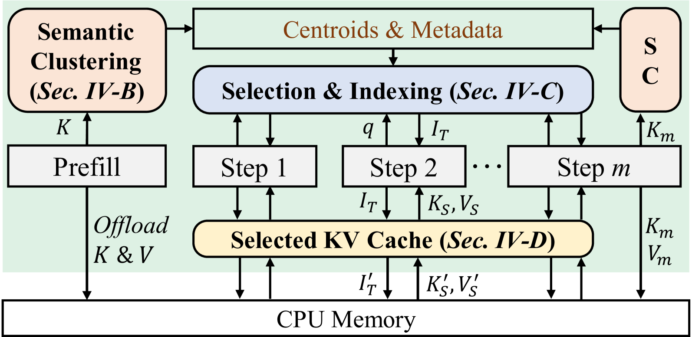

# ClusterKV

https://arxiv.org/abs/2412.03213v1

## Abstract

1. **研究背景与挑战**  
   - **LLMs的广泛应用**：Large Language Models (LLMs) 被广泛部署于多种任务中，上下文长度（context length）持续增长以支持长文档QA和复杂逻辑推理。  
   - **长上下文的挑战**：  
     - 高内存开销：Key-Value (KV) cache 的内存成本高。  
     - 延迟增加：大量内存访问导致推理延迟上升。  

2. **现有方法的局限性**  
   - **KV cache压缩技术**：  
     1. **永久性淘汰（Permanent eviction）**：丢弃部分token且无法后续召回，影响模型准确性。  
     2. **按文本位置分页召回（Page-based recall）**：以固定文本位置分页召回token，导致输出质量下降。  

3. **ClusterKV的提出**  
   - **核心创新**：  
     - **语义聚类召回**：以语义聚类（semantic clusters）为粒度动态召回token。  
   - **技术实现**：  
     1. **高效算法设计**：涵盖聚类（clustering）、选择（selection）、索引（indexing）和缓存（caching）。  
     2. **系统优化**：支持低开销的KV cache管理。  

4. **实验与性能**  
   - **实验结果**：  
     - **准确性**：在32k上下文长度下，仅需1k-2k KV cache预算，准确性损失可忽略。  
     - **效率提升**：  
       - 延迟降低2倍。  
       - 解码吞吐量提升2.5倍。  
   - **对比SoTA**：在模型准确性、输出质量和推理效率上均优于现有可召回KV压缩方法。  

5. **贡献总结**  
   - 首次实现基于语义粒度的KV cache动态压缩与召回。  
   - 在效率与准确性之间取得平衡，为长上下文推理提供实用解决方案。

## Introduction

1. **研究背景与挑战**  
   - **LLMs的长上下文需求**：随着任务复杂化（如长文档QA、代码库理解等），模型需支持更长上下文窗口（从4k扩展到1M tokens）。  
   - **KV缓存效率问题**：  
     - 自回归解码阶段因KV缓存线性增长导致GPU内存不足和高延迟。  
     - 传统方法（如固定模式选择或基于attention权重的token压缩）存在动态重要性捕获不足的问题。  

2. **现有KV缓存压缩方法的局限性**  
   - **不可召回式压缩**：  
     - 永久淘汰"不重要"token，无法适应token重要性的动态变化（如Fig. 1b）。  
   - **召回式压缩的代价**：  
     - 计算所有历史token的attention权重成本过高。  
     - **Quest的页粒度召回**[14]：  
       - 通过连续token分页降低开销，但存在内部碎片化问题（召回页可能含无用token）。  

3. **ClusterKV方法**  
   - **核心创新**：  
     - **语义簇粒度召回**：基于token在语义/键向量空间的邻近性分组（如Fig. 2），实现精准召回（如Fig. 1d）。  
   - **系统优化**：  
     - 专用系统设计和优化内核以最小化召回开销。  
   - **实验效果**：  
     - 在32k上下文长度下，仅需1k-2k KV缓存预算即可保持精度损失可忽略。  
     - 延迟降低2倍，解码吞吐量提升2.5倍，模型精度和输出质量显著优于SOTA方法。  

## Related works

1. **KV Cache压缩的可召回性（Recallable KV Cache Compression）**
   - **问题背景**：现有方法仅计算被选中token的attention weights，未选中的token会被永久丢弃，导致无法动态召回。
   - **动态重要性观察**：token的重要性在推理过程中动态变化（如Llama-3-8B示例），非可召回压缩会遗漏关键token，降低模型输出质量。
2. **现有可召回KV压缩方法的缺陷**
   - **计算成本问题**：计算所有历史token的attention weights会导致O(Ld)的高成本，抵消压缩优势。
   - **现有方法局限性**：
     1. **InfiniGen**：通过SVD降维减少计算，但需额外存储partial keys，且成本仍与上下文长度L线性相关。
     2. **Quest**：以page（连续token组）为单位选择，通过per-channel maximal keys估算重要性，但存在内部碎片化问题（重要token分散，浪费KV cache预算）。
3. **案例分析**
   - **Llama3-8B的attention热力图**：显示page划分效率低下（如16-token page中仅含1-2个重要token），导致资源浪费。

## Algorithm Design

### Problem Formulation and Design Rationale

1. **问题表述（Problem Formulation）**
   - **近似注意力计算的目标**：通过选择关键token（$I_T = \{i_1, i_2, \dots, i_B\}$）来最大化注意力权重之和（$\arg \max \sum_{i \in I_T} q k_i^T$），从而逼近原始注意力计算。
   - **关键变量定义**：
     - $K_S$：选定token的key向量集合，形式为$(k_{i_1}, k_{i_1}, \dots, k_{i_B})^T$。
     - 选择标准：保留top-$B$个最大注意力权重的token。

2. **设计原理（Design Rationale）**
   - **语义空间聚类假设**：语义相近的token对给定query（$q$）的注意力权重相似。
   - **基于聚类的KV选择方法**：
     1. **聚类阶段**：在语义空间对token进行聚类。
     2. **权重计算与选择**：仅计算query与聚类表征的注意力权重，选择权重最大的聚类。
   - **优势**：聚类数量远少于token数量，显著降低计算开销（recall overhead）。

### Clustering in the Semantic Space

1. **语义距离（Semantic Distance）**
   - **定义**：通过计算key向量之间的距离来衡量token之间的语义距离，其中余弦相似度（cosine similarity）比L2距离或内积更适用。
   - **公式**：距离定义为$\mathcal{D}(i,j) = 1 - \frac{\langle k_i, k_j \rangle}{|k_i| \cdot |k_j|}$，距离越小表示余弦相似度越大。
   - **原因**：key向量中存在幅度较大的异常通道（outlier channels），导致L2或内积距离变化剧烈。

2. **K-means聚类方法**  
   - **初始化**：随机采样键向量作为初始质心。  
   - **迭代步骤**：  
     1. **分配步骤**：每个键向量根据距离$\mathcal{D}$（余弦相似度）分配到最近的质心，选择最大相似度的质心。  
     2. **更新步骤**：用同一质心所属键向量的均值更新质心。  
   - **收敛条件**：当分配不再变化时终止，形成以质心为语义表征的簇。  

3. **LLM推理中的聚类应用**  
   - **预填阶段处理**：  
     - **保留attention sinks**：前16个初始token作为例外（语义空间离群值）。  
     - **后续token聚类**：对剩余token聚类生成$C_0$个质心，其中$C_0 = \frac{L}{80}$（如32k上下文时$C_0=400$，平衡效率与精度）。  
   - **解码阶段处理**：  
     - **动态聚类**：每$m$步对新生成的$m$个token聚类，生成$C_+$新质心。  
     - **参数设置**：$C_+=4$，$m=320$，仅对生成token独立聚类以降低计算开销。

### Selection at the Granularity of Semantic Clusters

- **选择方法**：
  - 将聚类中心表示为$μ_1, μ_2, …, μ_C ∈ ℝ^d$。
  - 对给定查询$q$，根据注意力权重（即$qμ_i^T$）对聚类中心降序排序。
  - 使用内积（而非余弦相似度）衡量查询向量与聚类中心的距离，因其与注意力权重计算更一致。
  - 检索排序后的聚类中心，并收集对应聚类中的KV tokens，直到选出top-$B$最重要的tokens。
- **关键直觉**：注意力权重较大的聚类中的keys，其tokens的注意力权重也倾向于较大。

### Efficiency Concerns

- **优势**：基于聚类的选择避免了重要tokens的内部碎片化，相比基于page的选择（如Quest [14]）精度更高。
- **问题**：
  1. **聚类计算成本高**：计算复杂度为$O(n_iCLd)$（$n_i$为迭代次数，$C$为聚类数），高于基于page的方法（如Quest的$O(Ld)$）。
  2. **动态聚类带来的挑战**：
     - 基于page的方法中，page大小固定且tokens连续，所需page数可直接计算为$B/page\_size$。
     - 而语义聚类的大小可变，tokens位置动态且不连续，导致所需聚类数和选中tokens的索引无法直接确定。

#### 关键步骤与计算复杂度分析

1. **分配阶段（Assign Points to Clusters）**  
   对于每个向量（共L个），需要计算其到每个中心点的距离（共C个中心点）。每个距离计算需要**d次操作**（例如，欧氏距离的平方计算）。因此，每个向量的复杂度为$O(C \cdot d)$，总共有$L \cdot C \cdot d$次操作。  
   **复杂度：**$O(L \cdot C \cdot d)$

2. **更新中心阶段（Update Cluster Centers）**  
   对于每个簇，计算其所有点的平均值。每个簇的每个维度需要累加所有点的该维度值（总共有$L$个点），然后除以该簇的点数。所有簇的总操作次数为：  
   - **累加操作**：每个点的每个维度需被累加到对应的簇中，总共有$L \cdot d$次操作。  
   - **求平均操作**：每个簇的每个维度需要一次除法，总共有$C \cdot d$次操作。  
     因此，总复杂度为$O(L \cdot d + C \cdot d)$，主导项为$O(L \cdot d)$。  
     **复杂度：**$O(L \cdot d)$

#### 每次迭代的总复杂度

将分配和更新阶段的复杂度相加：  
$$
O(L \cdot C \cdot d) + O(L \cdot d) = O(L \cdot C \cdot d)
$$
（因为$C \cdot d$是主导项，当$C \geq 1$时）

#### 总迭代复杂度

经过$n$次迭代，总复杂度为：  

$$
\boxed{O(n \cdot L \cdot C \cdot d)}
$$

## System Design & Implementation

### Semantic Clustering

1. **系统级优化（System-level Optimization）**  
   - **异步聚类设计**：
     - 在QKV投影和RoPE模块计算键值后立即启动聚类（图6）。
     - 与当前层的attention/FFN计算、下一层的QKV投影/RoPE操作重叠执行。
   - **优势**：通过并行化降低聚类带来的额外开销。

2. **内核级优化（Kernel-level Optimization）**  
   - **批处理聚类（Batched Clustering）**：针对每个head独立聚类，优化跨head的批处理。  
     - **分配步骤（Assignment Step）**：利用现有高效的batched Torch kernel处理argmin和键-质心矩阵乘法。  
     - **质心更新步骤（Centroid Update Step）**：  
       1. 实现自定义CUDA kernel，通过ThreadBlocks并行处理不同head。  
       2. 在共享内存中累积同一cluster的键和计数，计算均值作为新质心。  
   - **写冲突优化**：  
     1. **线程布局**：沿序列维度（sequence dimension）跨步排列线程，减少同一cluster的并发处理。  
     2. **通道分区**：将通道维度分为$P$个分区，每个线程处理一个分区，并行处理$\frac{BlockSize}{P}$个键。  
     3. **参数权衡**：  
        - 较大$P$减少并行键数，增加序列维度迭代次数。  
        - 较小$P$增加通道维度迭代次数，可能加剧写冲突。  
     4. **离线调优**：实验确定最优$P$（如$BlockSize=512$时，$P=16$或$32$对128通道性能最优）。

### Selection and Indexing

1. **ClusterKV的存储结构**  
   - **元数据存储**：存储聚类中心（cluster centroids）、簇大小（cluster sizes）、前缀和（prefix sum）及排序索引（sorted indices）。  
   - **示例分配**：键$k_0$和$k_5$分配到簇2，$k_1$到簇0，$k_2$、$k_3$和$k_4$到簇1。通过元数据可快速获取各簇大小，并按簇标签排序存储索引。  

2. **解码阶段的簇选择与处理**  
   - **注意力计算**：计算查询向量$q$与簇中心$\mu$的注意力权重，按权重降序排序簇以确定最接近的簇。  
   - **预算控制**：根据KV缓存预算（如设置为3）选择簇。例如，若预算匹配第二个前缀和，则选择前$top-2$最接近的簇。  
   - **索引确定与调整**：收集选定簇的标签、大小及结束位置，确定所选标记的索引$I_T$。若总大小超过预算，从最后一个簇中裁剪token以符合限制。  

3. **高效CUDA实现**  
   - **并行处理**：通过CUDA内核并行处理KV头的索引，每个ThreadBlock独立执行任务。  
   - **内存优化**：高频访问的簇大小元数据存储在共享内存（shared memory），提升计算性能。

### Caching KV of Selected Tokens

1. **ClusterKV的GPU集群粒度缓存**  
   - **缓存目的**：减少CPU到GPU的不必要数据传输，提升性能。  
   - **缓存内容**：存储选定token的KV（Key-Value）及对应集群标签，保留最近$R$步解码的KV。  

2. **解码阶段的工作流程**  
   - **标签比对**：当前步骤的集群标签与缓存中的标签对比。  
   - **按需加载**：仅加载缓存中未命中的集群KV（从CPU内存读取）。  

3. **内存与缓存效果的权衡**  
   - **实践配置**：实验发现$R=1$（仅保留上一步解码的KV）能在内存占用和缓存效果间取得较好平衡。  

## Evaluation

1. **实验设置（Experimental Setup）**
   - **硬件配置**：在NVIDIA Ada 6000 GPU上评估ClusterKV。
   - **数据集**：
     - 使用LongBench的8个数据集：2WikiMQA、TriviaQA、HotpotQA、MultiFieldQA、MuSiQue、NarrativeQA、Qasper和GovReport。
     - 任务类型：单文档QA（single-doc QA）、多文档QA（multi-doc QA）、小样本学习（few-shot learning）和摘要生成（summarization），上下文长度最高达32k。
     - 语言建模任务：额外使用PG19数据集。
   - **评估模型**：采用支持128k上下文窗口的SOTA长上下文模型GLM4-9B-Chat。

2. **对比方法（Baselines）**
   - **对比的SOTA KV缓存压缩方法**：
     1. **Quest**：保留原始配置（如`page_size`），不对模型前两层进行KV缓存选择。
     2. **InfiniGen**：保留部分权重比（partial weight ratio）和选择阈值（selection threshold）等配置。
   - **公平性调整**：在ClusterKV和InfiniGen中，对齐Quest的设置，禁用前两层的KV缓存选择。
   - **性能评估模型**：因Quest和InfiniGen仅支持Llama架构，选用Llama-3.1-8B进行推理性能评估。