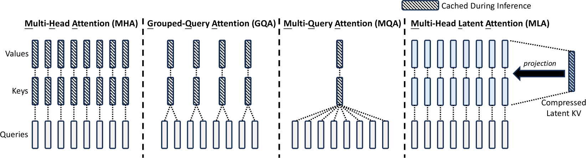
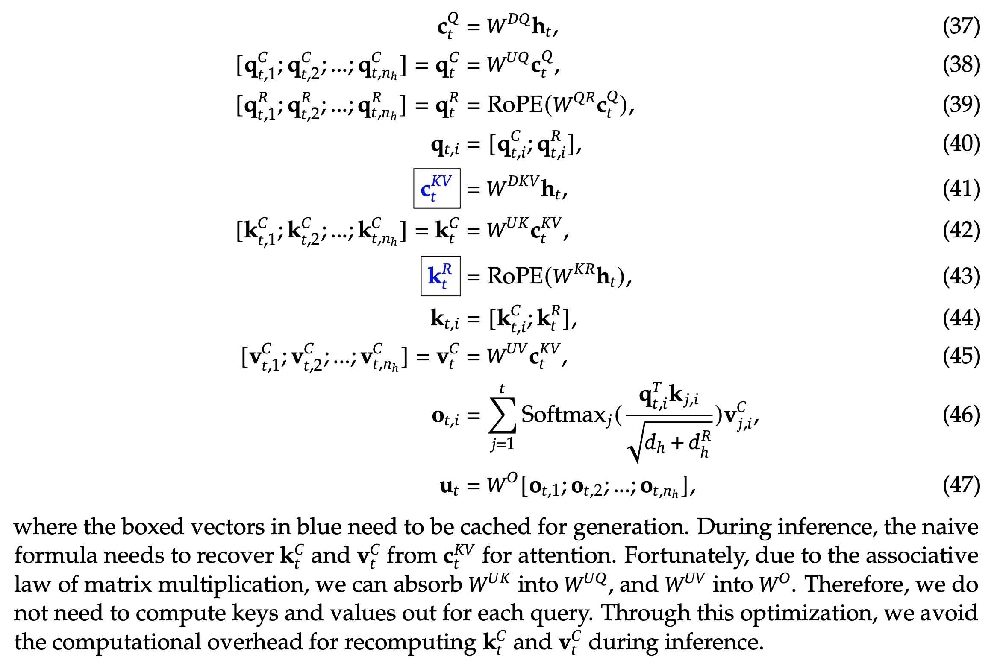

# DeepSeek-V2: A Strong, Economical, and Efficient Mixture-of-Experts Language Model

1. 模型概览
- 核心架构：基于Mixture-of-Experts (MoE)，总参数量236B，每token激活21B参数，支持128K tokens超长上下文。
- 核心优势：在降低训练成本（节省42.5%）的同时，实现高推理吞吐量（较前代提升5.76倍）与开源SOTA性能。

2. 关键技术创新
- 多头潜在注意力（MLA）  
  - 机制：通过低秩压缩KV缓存为潜在向量，减少93.3%缓存占用，同时保持性能优于传统MHA。
  - 效果：解决传统方法（GQA/MQA）因压缩KV缓存导致的性能损失问题。
- DeepSeekMoE架构  
  - 设计：细粒度专家分割 + 共享专家隔离策略，增强专业化能力。
  - 优化：专家并行策略实现负载均衡，稀疏计算降低训练成本，兼顾模型容量与计算效率。

3. 训练与优化
   1. 预训练：8.1T tokens
   2. 监督微调（SFT）：1.5M对话数据覆盖多领域（数学/代码/推理等）。  
   3. 强化学习（RL）：采用GRPO方法对齐人类偏好，生成最终Chat版本。

4. 开源版本
- DeepSeek-V2-Lite：轻量化版本（总参数15.7B，激活2.4B/Token），集成MLA与MoE技术，平衡性能与部署成本。

## MLA

压缩倍数：
$$
\frac{2\times \text{hidden\_size}+\text{n\_head}\times \text{qk\_rope\_head\_dim}}{\text{kv\_lora\_rank}+\text{qk\_rope\_head\_dim}}
$$

**输入**：当前时间步的隐藏状态 $\mathbf{h}_t$。

### **2. 查询向量生成（公式37-40）**
1. **基础查询向量**  
   - 将 $\mathbf{h}_t$ 通过线性变换 $W^{DQ}$ 得到中间向量 $\mathbf{c}_t^Q$：
     $\mathbf{c}_t^Q = W^{DQ}\mathbf{h}_t \tag{37}$
   - 分割为多个头（假设共有 $n_h$ 个头），每个头通过线性变换 $W^{UQ}$ 获得内容相关的查询向量 $\mathbf{q}_t^C$：
     $[\mathbf{q}_{t,1}^C; \dots; \mathbf{q}_{t,n_h}^C] = \mathbf{q}_t^C = W^{UQ}\mathbf{c}_t^Q \tag{38}$

2. **位置感知查询向量**  
   - 对 $\mathbf{c}_t^Q$ 进行另一组线性变换 $W^{QR}$，并添加 **RoPE（旋转位置嵌入）** 来编码位置信息，得到位置相关的查询向量 $\mathbf{q}_t^R$：
     $[\mathbf{q}_{t,1}^R; \dots; \mathbf{q}_{t,n_h}^R] = \mathbf{q}_t^R = \text{RoPE}(W^{QR}\mathbf{c}_t^Q) \tag{39}$

3. **合并查询向量**  
   - 每个头的查询向量由内容和位置部分拼接而成：
     $\mathbf{q}_{t,i} = [\mathbf{q}_{t,i}^C; \mathbf{q}_{t,i}^R] \tag{40}$

### **3. 键/值向量生成（公式41-45）**
1. **共享中间向量**  
   - 将 $\mathbf{h}_t$ 通过线性变换 $W^{DKV}$ 得到中间向量 $\mathbf{c}_t^{KV}$（需缓存用于后续推理）：
     $\boxed{\mathbf{c}_t^{KV}} = W^{DKV}\mathbf{h}_t \tag{41}$

2. **键向量**  
   - 分割 $\mathbf{c}_t^{KV}$ 为多个头，通过线性变换 $W^{UK}$ 得到内容相关的键向量 $\mathbf{k}_t^C$：
     $[\mathbf{k}_{t,1}^C; \dots; \mathbf{k}_{t,n_h}^C] = \mathbf{k}_t^C = W^{UK}\mathbf{c}_t^{KV} \tag{42}$
   - 添加 RoPE 编码位置信息，得到位置相关的键向量 $\mathbf{k}_t^R$：
     $\boxed{\mathbf{k}_t^R} = \text{RoPE}(W^{KR}\mathbf{h}_t) \tag{43}$
   - 合并内容和位置部分：
     $\mathbf{k}_{t,i} = [\mathbf{k}_{t,i}^C; \mathbf{k}_{t,i}^R] \tag{44}$

3. **值向量**  
   - 分割 $\mathbf{c}_t^{KV}$ 为多个头，通过线性变换 $W^{UV}$ 得到值向量 $\mathbf{v}_t^C$（仅保留内容部分）：
     $[\mathbf{v}_{t,1}^C; \dots; \mathbf{v}_{t,n_h}^C] = \mathbf{v}_t^C = W^{UV}\mathbf{c}_t^{KV} \tag{45}$

### **4. 注意力计算（公式46）**
- **单头注意力**  
  对每个头 $i$，计算当前查询 $\mathbf{q}_{t,i}$ 与历史键 $\mathbf{k}_{j,i}$ 的相似度，并加权求和对应的历史值 $\mathbf{v}_{j,i}^C$：
  $\mathbf{o}_{t,i} = \sum_{j=1}^t \text{Softmax}_j\left( \frac{\mathbf{q}_{t,i}^T \mathbf{k}_{j,i}}{\sqrt{d_h + d_r}} \right) \mathbf{v}_{j,i}^C \tag{46}$
  - **关键点**：
    - 分母 $\sqrt{d_h + d_r}$ 是缩放因子，其中 $d_h$ 是内容维度，$d_r$ 是位置维度。
    - 时间步 $j$ 从 $1$ 到 $t$，表示自回归（仅关注过去和当前 token）。

### **5. 多头融合（公式47）**
- **输出整合**  
  将所有头的输出 $\mathbf{o}_{t,i}$ 拼接后通过线性变换 $W^O$ 得到最终输出 $\mathbf{u}_t$：
  $\mathbf{u}_t = W^O [\mathbf{o}_{t,1}; \dots; \mathbf{o}_{t,n_h}] \tag{47}$

1. **低秩联合压缩机制（Low-Rank Joint Compression）**

   - **KV缓存压缩**：
     
     - **压缩公式**：
       $$
       \mathbf{c}_t^{KV} = W_{DKV} \mathbf{h}_t \quad (9) \\
       \mathbf{k}_t^C = W_{UK} \mathbf{c}_t^{KV} \quad (10) \\
       \mathbf{v}_t^C = W_{UV} \mathbf{c}_t^{KV} \quad (11)
       $$
     - **参数定义**：
       - $\mathbf{c}_t^{KV} \in \mathbb{R}^{d_c}$：键值对的压缩潜在向量
       - $d_c (\ll d_h n_h)$：KV压缩维度
       - $W_{DKV} \in \mathbb{R}^{d_c \times d}$：下投影矩阵
       - $W_{UK}, W_{UV} \in \mathbb{R}^{d_h n_h \times d_c}$：键和值的上投影矩阵
     - **推理优化**：
       - 仅需缓存$\mathbf{c}_t^{KV}$，总缓存大小为$d_c l$（$l$为层数）
       - $W_{UK}$可融合到查询投影矩阵$W_Q$，$W_{UV}$可融合到输出投影矩阵$W_O$，避免显式计算键值
     
   - **查询压缩（Query Compression）**：
     - **压缩公式**：
       $$
       \mathbf{c}_t^Q = W_{DQ} \mathbf{h}_t \quad (12) \\
       \mathbf{q}_t^C = W_{UQ} \mathbf{c}_t^Q \quad (13)
       $$
     - **参数定义**：
       - $\mathbf{c}_t^Q \in \mathbb{R}^{d_c'}$：查询的压缩潜在向量
       - $d_c' (\ll d_h n_h)$：查询压缩维度
       - $W_{DQ} \in \mathbb{R}^{d_c' \times d}$：查询下投影矩阵
       - $W_{UQ} \in \mathbb{R}^{d_h n_h \times d_c'}$：查询上投影矩阵
     - **设计目标**：降低训练时的激活内存（activation memory），但不减少KV缓存需求

2. **Rotary Position Embedding（RoPE）的兼容性问题**
   - **问题背景**：DeepSeek-V2计划采用RoPE（Su et al., 2024），但其与低秩KV压缩（low-rank KV compression）存在不兼容性。
   - **不兼容性根源**：
     - RoPE对keys和queries的位置敏感性导致低秩适配器（low-rank adapter）中的$W_{UK}$无法在推理阶段被吸收进$W_Q$。
     - 推理时需重新计算所有前缀token的keys，显著降低效率。

3. **解耦RoPE策略（Decoupled RoPE Strategy）**
   - **核心思想**：引入额外的多头查询（multi-head queries）$\mathbf{q}_{t,i}^R$和共享键$\mathbf{k}_t^R$独立承载RoPE。
   - **数学实现**：
     
     - **查询与键的生成**：
       $$
       \mathbf{q}_t^R = \text{RoPE}(W_{QR} \mathbf{c}_t^Q) \quad (14) \\
       \mathbf{k}_t^R = \text{RoPE}(W_{KR} \mathbf{h}_t) \quad (15)
       $$
     - **特征拼接**：
       $$
       \mathbf{q}_{t,i} = [\mathbf{q}_{t,i}^C; \mathbf{q}_{t,i}^R] \quad (16) \\
       \mathbf{k}_{t,i} = [\mathbf{k}_{t,i}^C; \mathbf{k}_t^R] \quad (17)
       $$
     - **注意力计算**：
       $$
       \mathbf{o}_{t,i} = \sum_{j=1}^t \text{Softmax}_j\left( \frac{\mathbf{q}_{t,i}^T \mathbf{k}_{j,i}}{\sqrt{d_h + d_h^R}} \right) \mathbf{v}_{j,i}^C \quad (18)
       $$
   - **参数说明**：
     - $W_{QR} \in \mathbb{R}^{d_h^R n_h \times d_c'}$和$W_{KR} \in \mathbb{R}^{d_h^R \times d}$分别生成解耦查询和键。
     - $d_h^R$为解耦查询/键的每头维度。

4. **推理效率优化**
   - **KV缓存设计**：需缓存解耦键$\mathbf{k}_t^R$，总KV缓存大小为$(d_c + d_h^R) \cdot l$（$l$为序列长度）。
   - **优势**：避免重新计算前缀token的keys，维持低秩压缩的推理效率。

## DeepSeekMoE

1. **DeepSeekMoE架构**  
   - **核心设计思想**：  
     1. **专家分段细化（Segmented Experts）**：将专家网络划分为更细粒度的模块，以提升专家的专业化程度和知识获取准确性。  
     2. **共享专家隔离（Isolated Shared Experts）**：通过隔离部分共享专家，减少路由专家（routed experts）之间的知识冗余。  
   - **性能优势**：在激活专家数和总参数量相同的条件下，显著优于传统MoE架构（如GShard）。  

2. **FFN输出计算**  
   - **公式定义**：  
     $$
     \mathbf{h}_t' = \mathbf{u}_t + \sum_{i=1}^{N_s} \text{FFN}_i^{(s)}(\mathbf{u}_t) + \sum_{i=1}^{N_r} g_{i,t} \cdot \text{FFN}_i^{(r)}(\mathbf{u}_t)  
     $$
     - **符号说明**：  
       - $N_s$：共享专家数量；$N_r$：路由专家数量  
       - $\text{FFN}_i^{(s)}(\cdot)$：第$i$个共享专家；$\text{FFN}_i^{(r)}(\cdot)$：第$i$个路由专家  
       - $g_{i,t}$：第$i$个专家对第$t$个token的门控值  

3. **门控机制与专家选择**  
   - **门控值计算**：  
     $$
     g_{i,t} = \begin{cases}  
     s_{i,t}, & s_{i,t} \in \text{Topk}(\{s_{j,t} | 1 \leq j \leq N_r\}, K_r) \\  
     0, & \text{否则}  
     \end{cases}  
     $$
     - **关键参数**：$K_r$为激活的路由专家数量。  
   - **Topk选择**：仅保留与token亲和力最高的前$K_r$个路由专家。  

4. **专家亲和力计算**  
   - **Softmax公式**：  
     $$
     s_{i,t} = \text{Softmax}_i(\mathbf{u}_t^\top \mathbf{e}_i)  
     $$
     - **符号说明**：  
       - $\mathbf{e}_i$：当前层第$i$个路由专家的中心点（centroid）  
         - $\mathbf{e}_i$ 通常通过随机初始化生成，例如从均匀分布或正态分布中采样，作为专家的初始表征向量。
         - 路由专家（$\text{FFN}_i^{(r)}$）的中心点 $\mathbf{e}_i$ 仅影响其自身的激活概率，而共享专家的输出始终被直接累加到FFN结果中。
       - $s_{i,t}$：第$t$个token与第$i$个路由专家的亲和力分数。

### **设备限制路由机制（Device-Limited Routing Mechanism）**  

- **设计背景**：  
  - 在专家并行（expert parallelism）下，MoE通信成本与token目标专家覆盖的设备数成正比。  
  - DeepSeekMoE因细粒度专家划分导致激活专家数量多，通信成本显著增加。  
- **核心目标**：通过限制每个token的目标专家分布设备数（最多$M$），约束MoE通信开销。  

**DeepSeek-V2的路由策略实现**  

- **两阶段选择流程**：  
  1. **设备筛选**：为每个token选择具有最高亲和力分数（affinity scores）的$M$个设备。  
  2. **专家选择**：在筛选出的$M$设备内执行top-K专家选择。  
- **实验结论**：当$M \geq 3$时，设备限制路由的性能与无限制top-K路由基本一致。

### Auxiliary Loss for Load Balance

1. **负载平衡的路由策略设计**  
   - **设计动机**：  
     - 不平衡负载导致路由崩溃风险（Shazeer et al., 2017），影响专家模型的充分训练与利用。  
     - 专家并行（expert parallelism）场景下，负载不均衡会降低计算效率。  
   - **解决方案**：在DeepSeek-V2训练中引入三种辅助损失：  
     1. 专家级负载平衡损失（ℒ_ExpBal）  
     2. 设备级负载平衡损失（ℒ_DevBal）  
     3. 通信平衡损失（ℒ_CommBal）  

2. **专家级负载平衡损失（Expert-Level Balance Loss）**  
   - **公式定义**：  
     $$
     \mathcal{L}_{\text{ExpBal}} = \alpha_1 \sum_{i=1}^{N_r} f_i P_i  
     $$
     - $f_i = \frac{N_r}{K_r T} \sum_{t=1}^T \mathbf{1}(\text{Token } t \text{ selects Expert } i)$  
     - $P_i = \frac{1}{T} \sum_{t=1}^T s_{i,t}$  
   - **参数解释**：  
     - $\alpha_1$：专家级平衡因子（超参数）。  
     - $\mathbf{1}(\cdot)$：指示函数；$T$为序列长度；$s_{i,t}$为token $t$选择专家$i$的概率。  

3. **设备级负载平衡损失（Device-Level Balance Loss）**  
   - **分组策略**：将专家划分为$D$组$\{\mathcal{E}_1, \mathcal{E}_2, \dots, \mathcal{E}_D\}$，每组部署于单个设备。  
   - **公式定义**：  
     $$
     \mathcal{L}_{\text{DevBal}} = \alpha_2 \sum_{i=1}^D f'_i P'_i  
     $$
     - $f'_i = \frac{1}{|\mathcal{E}_i|} \sum_{j \in \mathcal{E}_i} f_j$  
     - $P'_i = \sum_{j \in \mathcal{E}_i} P_j$  
   - **参数解释**：  
     - $\alpha_2$：设备级平衡因子（超参数）。  

4. **通信平衡损失（Communication Balance Loss）**  
   - **设计目标**：确保设备间通信负载均衡，避免因接收token过多导致效率下降。  
   - **公式定义**：  
     $$
     \mathcal{L}_{\text{CommBal}} = \alpha_3 \sum_{i=1}^D f''_i P''_i  
     $$
     - $f''_i = \frac{D}{MT} \sum_{t=1}^T \mathbf{1}(\text{Token } t \text{ is sent to Device } i)$  
     - $P''_i = \sum_{j \in \mathcal{E}_i} P_j$  
   - **机制约束**：  
     - 设备限制路由机制确保每台设备发送至多$MT$隐藏状态。  
     - 通信平衡损失鼓励每台设备接收约$MT$隐藏状态，实现信息均衡交换。  
   - **参数解释**：  
     - $\alpha_3$：通信平衡因子（超参数）。

1. **设备级Token-Dropping策略**  
   - **策略目标**：缓解负载不均衡导致的计算资源浪费，补充平衡损失（balance losses）无法保证严格负载均衡的局限性。  
   - **计算预算分配**：  
     - 为每个设备计算平均计算预算（computational budget），此时设备容量因子（capacity factor）设为$1.0$。  
   - **Token丢弃机制**：  
     - 参考Riquelme等（2021）方法，按亲和力分数（affinity scores）从低到高丢弃Token，直至满足设备计算预算。  
   - **保留策略**：  
     - 确保约10%的训练序列（training sequences）的Token永不被丢弃，以维持数据完整性。  
   - **推理阶段灵活性**：  
     - 可根据效率需求，在推理时动态选择是否启用Token-dropping，同时保证训练与推理行为一致。

## Pre-training

### Data Construction  
- **数据量与质量扩展**  
  - 继承DeepSeek 67B的数据处理流程，优化清洗恢复误删数据，扩展互联网数据以增加语料规模。  
  - 增加中文数据占比，提升中文互联网语料的利用效率。  
- **数据质量控制**  
  - 整合多源高质量数据，改进基于质量的过滤算法，去除无益数据并保留有价值数据。  
  - 过滤争议内容以减少文化偏见，具体分析见附录E。  
- **分词器与数据统计**  
  - 采用基于**Byte-level Byte-Pair Encoding (BBPE)** 的分词器，词汇量10万。  
  - 预训练语料总规模8.1T tokens，中文token占比比英文高12%。  

### Hyper-Parameters

#### **模型超参数**  
1. **模型架构参数**  
   - **Transformer层配置**：设置60层Transformer，隐藏维度为5120。  
   - **参数初始化**：所有可学习参数以标准差0.006随机初始化。  

2. **MLA配置**  
   - **注意力头数与维度**：MLA中设置注意力头数$n_h$为128，每个头维度$d_h$为128。  
   - **压缩维度**：  
     - KV压缩维度$d_c$设为512。  
     - Q压缩维度$d_c'$设为1536。  
   - **解耦查询与键**：解耦后的Q维度$d_h^R$设为64。  

3. **MoE层配置**  
   - **专家替换**：除第一层外，所有前馈网络（FFNs）替换为MoE层。  
   - **专家结构**：  
     - 每个MoE层包含2个共享专家和160个路由专家。  
     - 每个专家的中间隐藏维度为1536。  
   - **专家激活**：每个token激活6个路由专家。  

4. **训练稳定性措施**  
   - **RMS Norm层**：在压缩的潜在向量后添加额外的RMS Norm层。  
   - **缩放因子**：在宽度瓶颈处（即压缩的潜在向量和路由专家的中间隐藏状态）乘以额外的缩放因子，确保训练稳定。  

5. **模型规模**  
   - **总参数量**：DeepSeek-V2共有236B参数。  
   - **激活参数量**：每个token激活21B参数。

#### **训练超参数**  
- **优化器与学习率**  
  - **AdamW**优化器：β₁=0.9，β₂=0.95，weight decay=0.1。  
  - **学习率调度**：  
    - Warmup 2K步后分阶段衰减（60%和90% tokens处乘以0.316）。  
    - 最大学习率：2.4×10⁻⁴，梯度裁剪范数：1.0。  
- **批量与序列设置**  
  - 批量大小从2304逐步增至9216，后续保持。  
  - 最大序列长度：4K，训练数据量：8.1T tokens。  
- **并行策略**  
  - **管道并行**：模型层分布于不同设备，路由专家均匀部署于8设备（D=8）。  
  - 每token最多发送至3设备（M=3），平衡损失系数：α₁=0.003，α₂=0.05，α₃=0.02。  
- **加速策略**  
  - 训练时采用token-dropping策略加速，但评估时不丢弃任何token。

## Alignment

### SFT

1. **数据集构建与训练细节**  
   - **数据规模与构成**：包含150万条指令微调数据，其中120万条用于评估模型的有用性（helpfulness），30万条用于安全性（safety）。  
   - **数据质量改进**：通过优化数据质量减少幻觉（hallucination）响应，提升模型的写作能力。  
   - **训练参数**：对DeepSeek-V2进行2个epoch的微调，学习率设置为$5 \times 10^{-6}$。  
3. **模型对比与结果引用**  
   - **对比模型**：在相同评估框架下对比Qwen1.5 72B Chat、LLaMA-3-70B Instruct和Mistral-8x22B Instruct。  
   - **历史版本参考**：DeepSeek 67B Chat的评估结果直接引用先前发布的数据。  
4. **评估重点**  
   - **多维度覆盖**：涵盖生成质量、代码能力、对话连贯性和指令遵循等核心能力。  
   - **避免偏见设计**：通过多样化的评估任务减少特定任务或策略的偏好，确保评估全面性。

### RL

1. **两阶段强化学习（RL）训练策略**
   - **阶段划分依据**：推理任务（如代码、数学问题）与通用数据的RL训练特性差异显著，推理能力可随训练步数长期提升。
   - **第一阶段：推理对齐（Reasoning Alignment）**
     1. **奖励模型设计**：构建专用奖励模型 $RM_{reasoning}$，针对代码和数学推理任务。
     2. **奖励计算**：基于 $RM_{reasoning}$ 的反馈优化策略模型，公式为 $r_i = RM_{reasoning}(o_i)$（公式35）。
   - **第二阶段：人类偏好对齐（Human Preference Alignment）**
     1. **多奖励框架**：整合三类奖励模型：
        - **帮助性奖励模型** $RM_{helpful}$
        - **安全性奖励模型** $RM_{safety}$
        - **基于规则的奖励模型** $RM_{rule}$
     2. **最终奖励公式**：加权求和 $r_i = c_1 \cdot RM_{helpful}(o_i) + c_2 \cdot RM_{safety}(o_i) + c_3 \cdot RM_{rule}(o_i)$（公式36），其中 $c_1,c_2,c_3$ 为权重系数。

2. **奖励模型训练方法**
   - **数据收集策略**：
     - 代码偏好数据：基于编译器反馈生成。
     - 数学偏好数据：基于ground-truth标签标注。
   - **模型初始化与训练**：
     - 初始化模型：使用DeepSeek-V2 Chat（SFT）作为预训练基础。
     - 损失函数：采用point-wise或pair-wise损失进行微调。
   - **数据质量控制**：
     - 严格筛选数据质量。
     - 动态调整正负样本比例以确保奖励模型可靠性。

1. **工程优化措施（Engineering Optimizations）**
   - **混合引擎（Hybrid Engine）**：
     1. 采用差异化的并行策略分别管理训练与推理流程，提升GPU利用率（GPU utilization）。
     2. 通过动态资源分配策略平衡计算负载。
   - **vLLM推理加速**：
     1. 引入vLLM（Kwon et al., 2023）作为推理后端，支持大批次（large batch sizes）并行推理。
     2. 优化 token 级并行处理以加速推理速度。
   - **模型调度策略（Scheduling Strategy）**：
     1. 设计 CPU/GPU 模型迁移机制，动态卸载（offload）与加载模型。
     2. 实现训练速度与内存消耗（memory consumption）的近优平衡（near-optimal balance）。