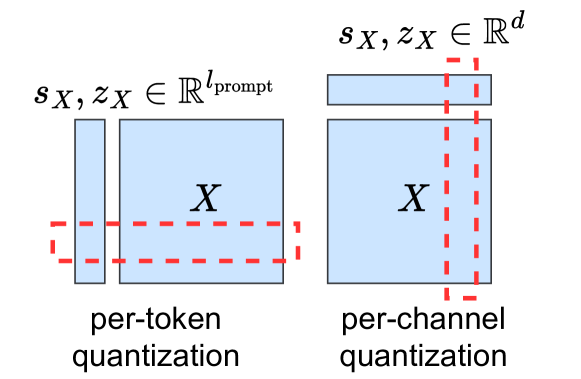
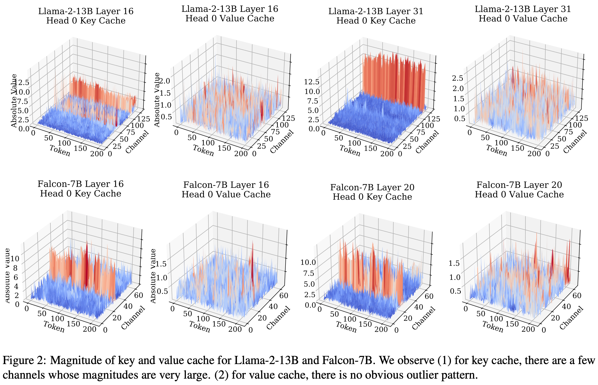
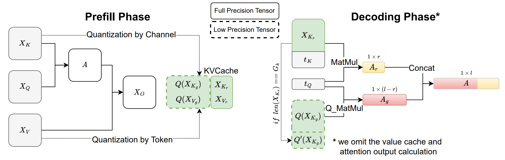

# KIVI: A Tuning-Free Asymmetric 2bit Quantization for KV Cache

https://arxiv.org/pdf/2402.02750

# Abstract

1. **KV缓存的挑战与量化需求**  
   - **问题背景**：大规模LLM服务需通过批量请求降低成本，但长上下文与大批次导致KV缓存（存储注意力键值对）成为内存与速度瓶颈。  
   - **核心矛盾**：KV缓存加载导致计算核心空闲，限制推理速度。  
   - **量化潜力**：量化可减少KV缓存占用，但缺乏对其元素分布的深入分析。

2. **KV缓存元素分布研究**  
   - **研究目标**：分析LLM中KV缓存的元素分布，指导量化策略。  
   - **关键发现**：  
     - **Key缓存**：需按通道（per-channel）分组量化，沿通道维度聚合元素。  
     - **Value缓存**：适合按token（per-token）独立量化。  

3. **KIVI量化算法**  
   - **设计原理**：基于分布差异的Key/Value分策略量化，无需调参。  
   - **实现特点**：硬件友好型设计，支持Llama、Falcon、Mistral等模型。  
   - **性能提升**：  
     - 峰值内存减少2.6倍（含模型权重）。  
     - 批量大小提升4倍，吞吐量增益2.35×∼3.47×。  

4. **实验与结果**  
   - **评估指标**：内存效率、推理吞吐量、模型精度保持。  
   - **验证场景**：真实LLM推理负载下的性能表现。  
   - **开源支持**：代码公开，促进复现与应用。  

5. **结论**  
   - KIVI通过细粒度量化策略突破KV缓存瓶颈，为LLM高效服务提供新范式。

# Introduction

**LLMs部署的挑战与KV缓存瓶颈**  

- **LLMs的性能与成本矛盾**：LLMs在多项任务中表现优异（如PaLM、GPT系列），但部署需要大量GPU等硬件加速器，单次请求成本高昂。  
- **批量处理的内存瓶颈**：  
  - **KV缓存的作用**：存储注意力机制中的键值对（key-value pairs），避免重复计算。  
  - **内存与速度问题**：  
    - 随着批次大小（batch size）和上下文长度（context length）增加，KV缓存占用内存显著增长。  
    - 例如，540B参数的PaLM模型在批次512、上下文长度2048时，KV缓存占用3TB内存（模型参数仅1TB）。  
    - GPU SRAM需在每次生成token时加载全部KV缓存，导致计算核心空闲，效率低下。  

**现有KV缓存优化方法**  

- **减少KV缓存头数**：  
  - **多查询注意力（Multi-Query Attention, MQA）**：通过共享不同头的键值向量减少缓存（Shazeer, 2019）。  
  - **多组注意力（Multi-Group Attention, MGA）**：分组共享键值向量（Ainslie et al., 2023）。  
  - **局限性**：需从头训练模型或微调现有模型。  
- **动态剔除不重要token**：  
  - 通过评估token重要性，动态移除冗余token以减少缓存占用（Zhang et al., 2023）。  
- **系统级优化**：  
  - **KV缓存卸载（Offloading）**：将部分缓存转移到CPU或存储设备（Sheng et al., 2023）。  
  - **虚拟内存与分页技术**：扩展传统内存管理机制至注意力机制，按需加载缓存（Kwon et al., 2023）。

**KV缓存量化分析**  

- **研究背景与现状**：  
  - 减少KV缓存体积的最直接方法是量化（quantization），但现有研究多聚焦于权重量化（weight quantization），对KV缓存量化的探索有限。  
  - 仅有少数工作（如Sheng et al., 2023）尝试对KV缓存应用基础的4bit均匀量化，受限于其流式特性（streaming nature）和复杂性。  
- **元素分布研究**：  
  - **Key缓存特性**：  
    - 存在少数固定通道（channel）的数值幅度显著较大，与先前研究（Lin et al., 2023; Xiao et al., 2023a）结论一致。  
    - 需采用逐通道量化（per-channel quantization），通过按通道分组量化限制误差传播（如图1右）。  
  - **Value缓存特性**：  
    - 无明显异常值模式，但需采用逐token量化（per-token quantization）。  
    - 原因：Value缓存用于计算注意力输出（attention output），本质是跨token的混合操作（value cache mixer），需避免量化误差跨token传播。  

**量化策略设计**  

- **Key缓存优化**：  
  - 按通道维度分组量化，确保误差仅影响单个通道，避免全局干扰。  
- **Value缓存优化**：  
  - 按token独立量化，防止单个token的量化误差扩散至其他token。  
- **实验验证**：  
  - 逐token量化可有效隔离误差，提升量化后KV缓存的稳定性与模型性能。

**KIVI方法**

- **核心思想**：提出即插即用的极低比特（2bit）KV缓存量化方法，通过键缓存逐通道（per-channel）量化与值缓存逐token（per-token）量化结合，解决自回归推理中的流式处理问题。
- **键缓存量化**：
  - 按通道量化，但因跨token量化无法直接适配流式处理，将键缓存分为**分组键缓存**（含多个完整token组）和**残差键缓存**（不足一组的token）。
  - 仅对分组键缓存进行组量化，残差部分保持全精度。
- **值缓存量化**：
  - 按token量化，与自回归生成的流式特性对齐，新量化张量可直接追加到现有值缓存的token维度。
  - 同样分为**分组值缓存**和**残差值缓存**，仅分组部分量化。
- **实现细节**：通过分块矩阵乘法（tiled matrix multiplication）合并分组与残差部分，计算注意力分数。

**贡献总结**

- **理论分析**：揭示KV缓存的异常值分布与量化误差特性，解释键/值缓存需差异化量化策略的原因。
- **算法创新**：提出无需微调的KIVI算法，支持硬件友好实现，实现KV缓存压缩至2bit。
- **实验效果**：
  - 在Llama-2-7B上实现$2.6\times$峰值内存缩减，且精度几乎无损。
  - 系统优化后支持最大$4\times$批处理量提升，吞吐量增益达$2.35\times \sim 3.47\times$。

# Methodology

## Preliminary Study of KV Cache Quantization

1. **KV缓存量化方法分析**  

   - **流式数据结构特性**：KV缓存以序列化方式接收新张量，导致基于优化的方法（如GPTQ）因开销过高不适用。  

   - **Round-to-Nearest量化**：  

     - **量化公式**： 

     $$
       Q(\mathbf{X}) = \left\lfloor \frac{\mathbf{X} - z_X}{s_X} \right\rceil, \quad \mathbf{X}' = Q(\mathbf{X}) \cdot s_X + z_X
     $$
       其中，$z_X = \min(\mathbf{X})$（零点），$s_X = \frac{\max(\mathbf{X}) - \min(\mathbf{X})}{2^B - 1}$（缩放因子）。  

     - **分组量化**：沿token或channel维度分组量化，忽略batch维度简化分析。  

2. **量化方法实现细节**  

   - **Per-token量化**：  
     - 主流方法，适用于流式KV缓存的追加操作（如Sheng et al., 2023）。  
   - **Per-channel量化**：  
     - 通过零填充解决分组不整问题，探索其对key/value缓存的影响。  

3. **实验设置与结果**  

   - **实验配置**：  
     - 模型：Llama-2-13B；任务：CoQA、TruthfulQA；分组大小：32。  
     - **Fake量化**：模拟量化-反量化过程，确保公平对比。  
   - **关键观察（OB）**：  
     1. **OB1**：key/value均采用per-token量化时，INT4精度可保持准确率，INT2显著下降。  
     2. **OB2**：value采用per-channel量化时（无论key量化方式），准确率大幅降低。  
     3. **OB3**：INT2下最优策略为key per-channel + value per-token量化。

## Why Key and Value Cache Should Quantize Along Different Dimensions?

1. **键缓存（Key Cache）量化分析**  
   - **观察结果**：  
     - 不同层的KV缓存分布可视化显示，键缓存中某些固定通道存在显著大值（outliers），而值缓存无明显异常模式。  
   - **量化方法对比**：  
     - **通道量化（per-channel quantization）**：将量化误差限制在单个通道内，避免影响其他正常通道，显著降低注意力分数误差（表2显示per-token量化导致约5倍更高的注意力误差）。  
     - **理论支持**：与先前研究（Dettmers et al., 2022; Lin et al., 2023）一致，激活值中的固定列异常值适合通道量化。  

2. **值缓存（Value Cache）量化分析**  
   - **观察结果**：  
     - 值缓存无通道级异常模式，图LABEL:fig:_vis无法直接解释为何需采用per-token量化（OB2）。  
   - **量化误差分析**：  
     - 通过公式$\Delta = \frac{\| \mathbf{A}\mathbf{X}_V - \mathbf{A}\mathbf{X}_V' \|_F}{\| \mathbf{A}\mathbf{X}_V \|_F}$评估注意力输出误差，发现per-token量化误差比per-channel量化小约15倍（表2）。  
   - **理论解释**：  
     - 注意力输出公式$[\mathbf{A}\mathbf{X}_V]_{i*} = \sum_{j=1}^{l_{\text{prompt}}} \mathbf{A}_{ij} [\mathbf{X}_V]_{j*}$表明，输出是值缓存的加权和（权重为稀疏注意力分数）。  
     - **per-token量化优势**：仅对重要token的值缓存误差进行局部限制，避免非重要token量化对结果的影响（Tian et al., 2023）。  
       - **误差局部性** ：
         当采用**per-token量化** 时，每个token的值缓存[**X***V*​]*j*∗​被独立量化。此时：
         - **重要token的误差被局部限制** ：若某个重要token的值缓存被量化，其误差仅影响自身的向量[**X***V*]*j*∗，而不会扩散到其他token；
         - **非重要token的误差被全局抑制** ：由于这些token的注意力权重**A***ij*≈0，即使它们的值缓存被量化（可能引入误差），对最终输出的贡献也微乎其微。
       - **Per-Channel量化的缺陷** ：
         若采用**per-channel量化** （按通道统一量化所有token的值缓存）：
         - 某个通道的量化误差会**全局性传播** 到所有token的对应通道；
         - 即使非重要token的权重很小，其通道误差仍可能通过重要token的高权重被放大（例如，若重要token的某通道值被错误量化，会导致输出误差显著增加）。

3. **实验验证（表1 & 表2）**  
   - **键缓存**：per-channel量化显著降低注意力误差（5倍差异）。  
   - **值缓存**：per-token量化实现更小输出误差（15倍差异），支持OB2结论。

## KIVI: Algorithm and System Support

1. **KIVI量化策略**  
   - **键缓存（Key Cache）量化**：  
     - 按通道（per-channel）量化，但需解决流式处理中的跨token量化问题。  
     - **分组量化方法**：  
       - 将键缓存$𝑿_K$分为分组部分$𝑿_K^g$（长度为$l−r$，可被$G$整除）和残差部分$𝑿_K^r$（长度$r$）。  
       - 分组部分$𝑿_K^g$按组量化，残差部分$𝑿_K^r$保持全精度。  
     - **动态更新机制**：  
       - 新token的键缓存$𝒕_K$追加到$𝑿_K^r$，当残差长度达$R$（超参数）时，量化并合并到$𝑿_K^g$，重置残差队列。  
       - 注意$R$需能被$G$整除。  

   - **值缓存（Value Cache）量化**：  
     - 按token（per-token）量化，维护全精度滑动窗口。  
     - **队列管理**：  
       - 新token的值缓存入队，队列满时弹出最旧缓存并量化，沿token维度追加到量化缓存。  

2. **注意力计算优化**  
   - **分块矩阵乘法**：  
     - 分组量化部分计算注意力得分$𝑨_g = 𝒕_Q Q(𝑿_K^{g⊤})$。  
     - 残差部分直接计算$𝑨_r = 𝒕_Q 𝑿_K^{r⊤}$，合并结果$𝑨 = Concat([𝑨_g, 𝑨_r])$。  

3. **预填充阶段处理**  
   - 精确键值张量传递至下一层，仅量化缓存保留在内存中。  

4. **方法分析**  
   - **内存效率**：  
     - 残差部分$𝑿_K^r$和$𝑿_V^r$长度$R≤128$，内存开销可忽略，适合长上下文场景。  
   - **滑动窗口作用**：  
     - 键缓存窗口大小为$R^2$，值缓存为$R$，维持局部相关token的全精度表示，对复杂任务（如GSM8K）性能至关重要。  

5. **系统实现**  
   - **硬件优化**：  
     - 使用CUDA融合反量化与矩阵乘法（Q_MatMul）。  
     - Triton实现分组量化内核。  
   - **兼容性**：  
     - 支持权重仅量化（weight-only quantization）。  

# Related work

1. **LLM推理量化技术**  
   - **权重量化方法**：  
     - **AWQ**：基于激活感知的INT4/INT3权重量化（Lin et al., 2023）。  
     - **GPTQ**：利用近似二阶信息实现高效准确的权重量化（Frantar et al., 2022）。  
     - **SqueezeLLM**：结合敏感度非均匀量化与稠密-稀疏分解（Kim et al., 2023）。  
   - **激活-权重联合量化**：  
     - **SmoothQuant**：通过等效变换平衡激活与权重的量化难度，支持8bit KV缓存压缩（Xiao et al., 2023a）。  
     - **FlexGen**：4bit分组量化KV缓存（Sheng et al., 2023）。  

2. **KIVI方法核心设计**  
   - **每通道量化方案**：基于键（Key）缓存比值（Value）缓存含更多异常值的观察（Section 3.2 & Figure LABEL:fig:_vis）。  
   - **与ATOM/KVQuant的关联**：独立发现键缓存异常值现象，并扩展分析（Zhao et al., 2024; Hooper et al., 2024）。  

3. **系统级优化方向**  
   - **vLLM**：通过PagedAttention实现内存管理（Kwon et al., 2023）。  
   - **S3**：基于内存使用预测优化吞吐量（Jin et al., 2023）。  
   - **与本文关系**：系统级优化可与KIVI算法结合使用。  

4. **KV缓存压缩替代方案**  
   - **H2O**：保留注意力分数显著的少量token（Zhang et al., 2023）。  
   - **Scissorhands**：基于重要性假设的KV缓存稀疏化（Liu et al., 2024）。  
   - **StreamingLLM**：利用“注意力下沉”现象仅维护初始token（Xiao et al., 2023b）。  
   - **与KIVI对比**：KIVI保留所有token并压缩为低精度，可与其他方法结合。  

5. **技术正交性**  
   - 权重量化、系统优化、缓存剪枝等方法均可与KIVI组合使用，体现技术互补性。