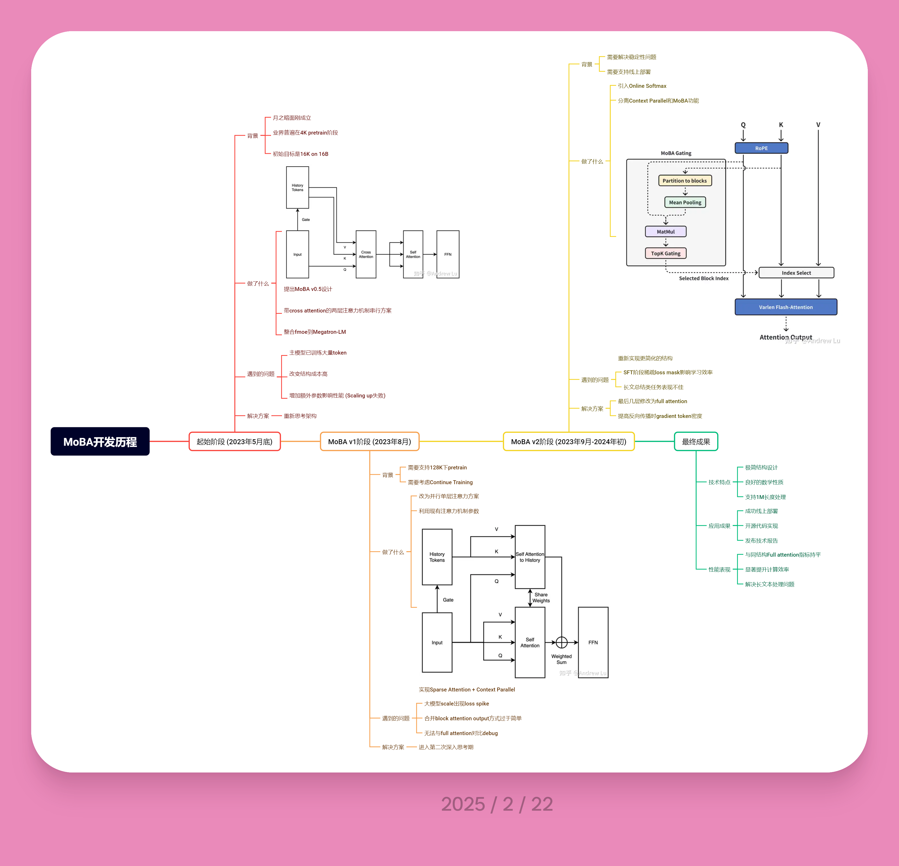
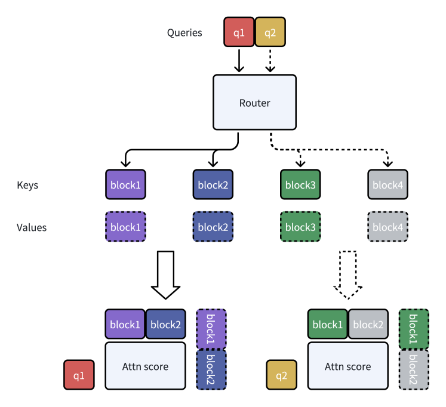

---
MoBA
---

# MoBA: Mixture of Block Attention for Long-Context LLMs

https://arxiv.org/abs/2502.13189

## Abstract

1. **问题背景**  
   - **有效上下文长度的重要性**：扩展有效上下文长度对大型语言模型（LLMs）向通用人工智能（AGI）发展至关重要。  
   - **传统注意力机制的挑战**：传统注意力机制的二次计算复杂度导致显著计算开销，阻碍模型扩展性。  

2. **现有方法的局限性**  
   - **强结构偏置方法**：如Sink或窗口注意力（window attention），依赖任务特定结构，可能引入偏差。  
   - **线性近似方法**：将注意力机制改为线性形式（如稀疏注意力），但复杂推理任务中的性能未充分验证。  

3. **提出的MoBA方法**  
   - **核心思想**：基于混合专家（Mixture of Experts, MoE）原理，创新性地应用于注意力机制设计。  
   - **设计原则**：遵循“less structure”原则，允许模型自主决定注意力位置，而非预定义结构。  
   - **架构特点**：  
     1. **块注意力混合形式**：结合块注意力（Block Attention）的混合结构，提升长上下文任务性能。  
     2. **动态切换能力**：支持在密集（full attention）和稀疏（sparse attention）注意力模式间无缝切换，平衡效率与性能。  

4. **应用与效果**  
   - **部署应用**：已部署至Kimi，支持长上下文请求处理。  
   - **性能表现**：在长上下文任务中展现显著优势，验证了高效注意力计算方法的有效性。  
   - **开源代码**：代码公开（https://github.com/MoonshotAI/MoBA），促进研究与应用。

## Introduction

1. **AGI驱动下的LLMs发展**  
   - **核心能力**：长序列处理（处理、理解和生成）是实现AGI的关键，支撑复杂任务如历史数据分析、复杂推理与决策。  
   - **模型进展**：  
     1. **长输入提示理解**：Kimi（MoonshotAI 2023）、Claude（Anthropic 2023）、Gemini（Reid et al. 2024）等模型展示相关能力。  
     2. **长CoT输出能力**：Kimi k1.5（Team et al. 2025）、DeepSeek-R1（D. Guo et al. 2025）、OpenAI o1/o3（Guan et al. 2024）等探索长链式思考（CoT）生成。  

2. **扩展序列长度的挑战**  
   - **计算复杂度问题**：传统注意力机制（vanilla attention, Waswani et al. 2017）的二次复杂度增长导致扩展困难。  

3. **效率提升的研究方向**  
   - **稀疏注意力机制**：  
     1. **数学基础**：softmax操作导致注意力分数天然稀疏，多种稀疏模式被研究（H. Jiang et al. 2024）。  
     2. **生物学启发**：大脑记忆相关区域的稀疏连接（Watson et al. 2025）为稀疏性提供生物学依据。

1. **现有方法的局限性**  
   - **结构约束方法**：如Sink-based、Sliding Window Attention等，虽能利用稀疏性，但任务特定性强，泛化能力受限。  
   - **动态稀疏注意力机制**：如Quest、Minference、RetrievalAttention等，虽减少推理计算，但无法显著降低长上下文模型的训练成本，难以扩展至百万级token。  
   - **线性注意力模型**：如Mamba、RWKV、RetNet等，通过线性近似降低计算量，但与传统注意力差异大，模型转换成本高或需从头训练，且复杂推理任务效果有限。  

2. **研究问题与目标**  
   - 如何设计一种**鲁棒且可适配的注意力架构**，保留Transformer框架，遵循“less structure”原则，允许模型自主选择关注区域，而非依赖预定义约束？  
   - 目标：实现**全注意力与稀疏注意力的无缝切换**，提升与预训练模型的兼容性，同时兼顾高效推理与训练。  

3. **MoBA方法介绍**  
   - **核心思想**：基于Mixture of Experts (MoE) 架构，将MoE思想应用于Transformer的注意力机制，动态选择历史相关块的键（Key）与值（Value）。  
   - **优势**：通过动态块选择，减少计算开销，支持长上下文处理，同时保持模型性能。  

4. **MoBA架构细节**  
   - **块划分与路由策略**：  
     1. **上下文分块**：将长序列划分为固定大小的块。  
     2. **门控机制**：为每个查询（Query）动态选择最相关的块，通过 gating 网络路由计算。  
   - **计算效率**：采用**块稀疏注意力**，计算复杂度从$O(n^2)$降至$O(n \cdot b)$（$b$为块数量），显著降低长序列处理成本。  

5. **实验结果**  
   - **长序列任务表现**：在复杂推理任务中，MoBA的性能与全注意力模型接近，同时资源消耗随序列长度增长的比例显著降低。  
   - **效率对比**：相比传统注意力和线性注意力模型，MoBA在训练与推理阶段均实现更高的计算效率。  

6. **贡献**  
   - 提出**MoBA架构**，结合MoE与稀疏注意力，平衡计算效率与模型性能。  
   - 推动LLM处理超长上下文（百万级token）的可行性，拓展复杂任务的边界。

### Related Work

**高效注意力机制的发展**：随着LLMs的兴起，处理长序列和降低计算成本的需求推动了高效注意力机制的研究，旨在降低自注意力的二次复杂度同时保持性能。  

1. **静态稀疏注意力模式（Static Sparse Patterns）**  
   - **核心方法**：通过固定模式减少计算量，包括strided/fixed attention、window attention、global token attention等。  
   - **代表性模型**：
     1. Sparse Transformer (2019)、Star-Transformer (2019)、BlockBERT (2019)、Longformer (2020)、BigBird (2020)、LongNet (2023)等。
     2. 多模态应用：axial attention（2D图像）、spatial-temporal attention（3D视频）。  
2. **动态稀疏注意力模式（Dynamic Sparse Patterns）**  
   - **自适应机制**：根据输入动态选择关注的token，而非固定模式。  
   - **关键技术**：  
     1. Reformer (2020)：使用LSH哈希聚类。  
     2. Routing Transformer (2021)：基于K-means聚类。  
     3. Memorizing Transformers (2022)、Unlimiformer (2024)：kNN算法选择token。  
     4. CoLT5 (2023)：路由模块选择关键query/key。  
     5. Sparse Sinkhorn Attention (2020)：动态块稀疏计算。  
3. **无需训练的稀疏注意力（Training-free Sparse Attention）**  
   - **优化阶段**：分为预填（prefill）和解码（decode）阶段的效率提升。  
     - **Prefill优化**：利用完整提示进行注意力分析，探索复杂模式。  
       1. MoA (2024)、Minference (2024)、SeerAttention (2024)：采用A-shape、垂直分割等模式。  
     - **Decode优化**：压缩KV缓存以平衡生成速度与质量。  
       1. H2O (2024)、StreamingLLM (2023)、TOVA (2024)、FastGen (2023)、Quest (2024)：Quest结合min/max池化；Longheads (2024)使用top-1门控网络。  
4. **超越传统注意力架构（Beyond Traditional Attention）**  
   - **替代架构探索**：  
     1. **CNN/RNN启发**：Hyena (2023)、RWKV (2023)、Mamba (2023)。  
     2. **线性注意力（Linear Attention）**：Performer (2020)、Linformer (2020)。  
     3. **状态空间模型（SSM）**：RetNet (2023)。  
   - **特点**：需从头训练，无法复用预训练Transformer模型。  

## MoBA

### MoBA

1. **MoBA机制概述**  
   - **核心思想**：与标准注意力机制不同，MoBA限制每个查询令牌仅关注键值对的子集。  
   - **公式定义**：$\text{MoBA}(q, K, V) = \text{Softmax}\left( qK[I]^\top \right)V[I]$ 
     其中$I \subseteq [N]$是选定的键值对索引集合。

2. **块划分与选择策略**  
   - **上下文分割**：将长度为$N$的上下文划分为$n$个块，块大小$B = \frac{N}{n}$。  
   - **块范围定义**：第$i$个块的索引范围为$I_i = [(i-1) \times B + 1, i \times B]$。  
   - **选择策略**：通过Top-$k$门控机制（借鉴MoE）筛选相关块，使查询聚焦于跨块的子集而非全局上下文。

3. **门控机制细节**  
   - **门控值计算**：  
    $$
     g_i = \begin{cases} 
     1 & s_i \in \text{Topk}(\{s_j | j \in [n]\}, k), \\
     0 & \text{otherwise}
     \end{cases}
    $$
     其中$g_i$表示第$i$个块是否被选中。  
   - **亲和力分数**：$s_i = \langle q, \text{mean\_pool}(K[I_i]) \rangle$，通过查询向量$q$与块内键的均值内积计算块的相关性。

4. **MoBA运行示例（MoBA Running Example）**  

- **动态路由机制**：如图1a所示，MoBA通过路由器（gating network）为每个query token动态选择top-2 KV blocks进行注意力计算。  
- **因果性保证（Causality）**：  
  1. **禁止关注未来blocks**：query token仅能路由到当前及过去的blocks，数学表示为：若$pos(\mathbf{q}) < i \times B$，则设置$s_i = -\infty$且$g_i = 0$。  
  2. **当前block的因果掩码**：强制query必须关注其所在block，并应用因果掩码防止信息泄漏，数学表示为：对包含$pos(\mathbf{q})$的block$I_i$设置$g_i = 1$。  

5. **关键设计选择（Key Design Choices）**  

- **细粒度block分割（Fine-Grained Block Segmentation）**：  
  - 受MoE启发，沿上下文长度维度进行细粒度分割，以探索性能提升潜力（实验见3.1节）。  
- **MoBA与全注意力的混合（Hybrid of MoBA and Full Attention）**：  
  - 支持训练中动态切换全注意力与MoBA模式，参数数量保持不变（实验见3.2节）。  

6. **与稀疏注意力架构对比（Comparison to Sparse Attention）**  

- **滑动窗口注意力（Sliding Window Attention, SWA）**：  
  - 可视为MoBA的特例，即路由器固定选择最近邻blocks。  
- **注意力池（Attention Sink）**：  
  - 可解释为MoBA路由器固定选择初始块和最近块的组合。  
- **MoBA优势**：更强的表达能力，可灵活近似多种静态稀疏注意力架构。  

### Implementation

1. **MoBA的高性能实现**
   - **技术基础**：结合FlashAttention和MoE的优化技术实现高效MoBA架构。
   - **核心流程**：
     1. **查询令牌分配**：通过门控网络（gating network）和因果掩码（causal mask）确定查询令牌（query tokens）到KV块（KV blocks）的映射。
     2. **令牌重排序**：根据分配的KV块对查询令牌进行重新排序。
     3. **分块注意力计算**：对每个KV块及其分配的查询令牌计算注意力输出，采用FlashAttention优化变长序列处理。
     4. **输出重排**：将分块计算的注意力输出恢复为原始顺序。
     5. **在线Softmax融合**：通过分块并行机制（tiling）合并多个KV块的注意力输出，支持历史块与当前块的联合注意力。

2. **算法流程细节**
   - **KV分块**：将KV矩阵划分为固定大小的块（Lines 1-2）。
   - **门控评分**：基于公式$𝐺_{𝑞,𝑏} = \text{softmax}(𝑊_𝑔 \cdot [𝑞; 𝑏])$计算查询与KV块的相关性（Lines 3-7）。
   - **稀疏映射**：通过$top_k$操作与因果掩码生成稀疏映射矩阵$𝑮$（Line 8）。
   - **分块计算分离**：
     - **历史块注意力**：独立计算历史KV块的注意力（Lines 11,14）。
     - **当前块注意力**：需额外维护因果关系的当前块计算（Lines 10,13）。
   - **输出归一化**：采用在线Softmax实现多块注意力输出的动态归一化（Line 16）。

## 算法实现

MoBA（Mixture of Block Attention）算法通过分块和动态块选择优化注意力计算，具体流程如下：

### 1. **输入与初始化**
- **输入**：查询矩阵$\mathbf{Q}$，键矩阵$\mathbf{K}$，值矩阵$\mathbf{V}$，维度均为$N \times h \times d$（$N$为序列长度，$h$为多头注意力头数，$d$为每个头的维度）。
- **超参数**：块大小$B$和 top-$k$选择数量。
- **块划分**：将序列划分为$n = N / B$个块，每个块包含$B$个元素。

### 2. **块划分**
- 将$\mathbf{K}$和$\mathbf{V}$分割为$n$个块：
 $$
  \{\tilde{\mathbf{K}}_i, \tilde{\mathbf{V}}_i\} = \text{split\_blocks}(\mathbf{K}, \mathbf{V}, B)
 $$
  每个块$\tilde{\mathbf{K}}_i, \tilde{\mathbf{V}}_i \in \mathbb{R}^{B \times h \times d}$。

### 3. **动态块选择**
- **计算块级相似度**：
  - 对$\mathbf{K}$进行平均池化，得到降维后的块表示$\bar{\mathbf{K}} \in \mathbb{R}^{n \times h \times d}$。
  - 计算查询与块表示的相似度矩阵$\mathbf{S} = \mathbf{Q} \cdot \bar{\mathbf{K}}^\top \in \mathbb{R}^{N \times h \times n}$。
  
- **因果掩码**：生成掩码矩阵$\mathbf{M}$，禁止当前块关注未来块。

- **选择top-$k$块**：结合相似度和因果约束，选择前$k$个块：
 $$
  \mathbf{G} = \text{topk}(\mathbf{S} + \mathbf{M}, k)
 $$

### 4. **组织注意力计算**
- **自注意力块**：提取每个块内的自注意力数据：
 $$
  \mathbf{Q}^s, \tilde{\mathbf{K}}^s, \tilde{\mathbf{V}}^s = \text{get\_self\_attn\_block}(\mathbf{Q}, \tilde{\mathbf{K}}, \tilde{\mathbf{V}})
 $$
  
- **跨块注意力**：根据选中的块$\mathbf{G}$索引对应的$\mathbf{Q}, \tilde{\mathbf{K}}, \tilde{\mathbf{V}}$：
 $$
  \mathbf{Q}^m, \tilde{\mathbf{K}}^m, \tilde{\mathbf{V}}^m = \text{index\_select\_mob\_attn\_block}(\mathbf{Q}, \tilde{\mathbf{K}}, \tilde{\mathbf{V}}, \mathbf{G})
 $$

### 5. **并行计算注意力**
- **自注意力计算**（因果约束）：
 $$
  \mathbf{O}^s = \text{flash\_attention\_varlen}(\mathbf{Q}^s, \tilde{\mathbf{K}}^s, \tilde{\mathbf{V}}^s, \text{causal=True})
 $$
  
- **跨块注意力计算**（无因果约束）：
 $$
  \mathbf{O}^m = \text{flash\_attention\_varlen}(\mathbf{Q}^m, \tilde{\mathbf{K}}^m, \tilde{\mathbf{V}}^m, \text{causal=False})
 $$

### 6. **合并结果**
- 使用在线 softmax 动态融合两种注意力输出：
 $$
  \mathbf{O} = \text{combine\_with\_online\_softmax}(\mathbf{O}^s, \mathbf{O}^m)
 $$
- 返回最终注意力输出$\mathbf{O}$。

