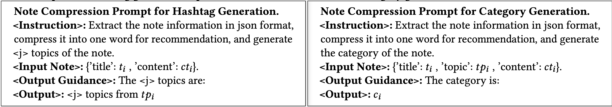

---
NoteLLM
---

# NoteLLM: A Retrievable Large Language Model for Note Recommendation


1. **背景与挑战**  
   - **笔记推荐的重要性**：用户在社区分享笔记，推荐符合兴趣的笔记是核心任务。  
   - **现有方法局限性**：  
     1. **BERT-based模型问题**：仅依赖笔记内容生成嵌入，忽略关键概念（如hashtag/category）。  
     2. **LLM潜力**：LLMs在语言理解上显著优于BERT，但未被充分应用于笔记推荐。  

2. **NoteLLM框架**  
   - **核心思想**：统一框架结合LLM解决item-to-item (I2I)笔记推荐。  
   - **关键组件**：  
     1. **Note Compression Prompt**：将笔记压缩为单个特殊token（如`<note>`），实现高效表征。  
     2. **对比学习（Contrastive Learning）**：通过正负样本对齐学习相关笔记的嵌入。  
     3. **指令调优（Instruction Tuning）**：  
       - **自动摘要生成**：利用LLM生成笔记摘要。  
       - **Hashtag/Category生成**：通过任务指令引导模型预测关键标签。  

3. **实验验证**  
   - **数据集与场景**：基于小红书（Xiaohongshu）真实场景验证。  
   - **性能提升**：  
     1. 相比在线baseline，推荐系统效果显著提升。  
     2. 验证了LLM在压缩、对比学习与多任务生成中的协同作用。
   
## Introduction

1. **研究背景与问题定义**  
   - **社交平台笔记推荐的重要性**：以小红书、Lemon8为例，UGC（用户生成内容）推荐通过个性化笔记提升用户参与度。  
   - **I2I推荐的核心挑战**：从海量笔记库中基于内容或协同信号检索相关笔记，但现有方法（如BERT-based模型）对标签/分类（hashtags/categories）的利用不足。  
   - **关键观察**：标签/分类浓缩笔记核心信息，与笔记嵌入生成过程本质相似，可互为监督信号增强表征学习。  

2. **NoteLLM框架设计**  
   - **统一多任务目标**：基于LLM（如LLaMA 2）联合优化I2I推荐与标签/分类生成任务，通过压缩笔记关键概念提升推荐性能。  
   - **Note Compression Prompt构造**：  
     1. 使用特殊token压缩笔记内容，同时生成标签/分类。  
     2. 通过共现分数（co-occurrence scores）构建相关笔记对（从用户行为数据统计）。  
   - **训练策略**：  
     1. **Generative-Contrastive Learning (GCL)**：以压缩token作为笔记嵌入，训练模型从负样本中识别相关笔记。  
     2. **Collaborative Supervised Fine-tuning (CSFT)**：监督生成标签/分类，强化关键概念提取能力。  

3. **技术贡献**  
   - **首个基于LLM的I2I推荐框架**：验证LLM在I2I任务中的有效性，揭示其增强推荐系统的潜力。  
   - **多任务学习机制**：通过标签/分类生成任务优化笔记嵌入，实验证明压缩概念学习对推荐质量的提升作用。  
   - **工业级验证**：在小红书离线实验与在线场景中验证框架有效性，证明其实际应用价值。  

4. **方法创新点**  
   - **标签/分类与嵌入的协同优化**：将标签生成任务融入推荐模型训练，突破传统I2I方法对内容理解的局限性。  
   - **压缩token驱动的对比学习**：利用LLM解码能力，通过对比学习直接优化嵌入空间，提升相关笔记检索精度。

## Related work

1. **I2I Recommendation**  
   - **核心定义**：基于目标物品从大规模物品池中生成排序列表，依赖预构建I2I索引或在线近似k近邻检索（Johnson et al., 2019）。  
   - **传统方法局限**：  
     1. **协同过滤依赖**：仅利用用户行为信号（Zhu et al., 2018），无法处理冷启动物品（cold-start items）。  
     2. **文本匹配演进**：从基于稀疏向量的关键词匹配（Robertson et al., 2009）转向深度学习嵌入表示（Mikolov et al., 2013；Devlin et al., 2018）。  
   - **LLM应用现状**：  
     1. 现有研究仅将LLM作为编码器生成嵌入（Jiang et al., 2023），未充分利用其生成能力。  
     2. **NoteLLM创新点**：通过LLM生成标签/类别（hashtags/categories）增强物品嵌入表示。  

2. **LLMs for Recommendation**  
   - **三大范式**：  
     1. **数据增强**：利用LLM知识库生成多样化数据（Xi et al., 2023），但依赖生成质量且需测试数据对齐。  
     2. **直接推荐**：通过提示工程（Wang et al., 2023b）或微调（Bao et al., 2023b）实现重排序（reranking），受限于上下文长度（仅数十候选）。  
     3. **编码器应用**：提取物品嵌入（Li et al., 2023），但忽略生成能力。  
   - **NoteLLM差异化**：在召回阶段（recall phase）集成LLM，并通过学习标签生成优化嵌入能力。  

3. **Hashtag/Category Generation from Text**  
   - **主流方法对比**：  
     1. **抽取式**：提取文本关键词（Zhang et al., 2016），无法获取未见标签。  
     2. **分类式**：视为文本分类任务（Zeng et al., 2018），受制于人工标签多样性。  
     3. **生成式**：端到端生成标签（Wang et al., 2019b），但局限于单一任务。  
   - **NoteLLM多任务框架**：  
     1. 联合I2I推荐与标签生成，利用任务相似性（task similarity）提升协同效果。  
     2. 通过LLM生成能力强化物品表征学习（representation learning）。
   
## Problem Definition

- **笔记池（note pool）**：定义为$\mathcal{N} = \{n_1, n_2, ..., n_m\}$，其中$m$为笔记总数。每个笔记$n_i = (t_i, tp_i, c_i, ct_i)$包含标题$t_i$、标签$tp_i$、类别$c_i$和内容$ct_i$。
- **I2I笔记推荐任务**：
 - **目标**：给定目标笔记$n_v$，基于LLM的检索器需从$\mathcal{N} \setminus \{n_v\}$中排序并推荐与$n_v$相似的top-$k$笔记。
- **任务关联性**：
 1. **标签生成（Hashtag generation）**：根据标题$t_i$和内容$ct_i$，利用LLM生成标签$tp_i$。
 2. **分类生成（Category generation）**：根据标题$t_i$、标签$tp_i$和内容$ct_i$，利用LLM生成类别$c_i$。

## Methodology


1. **NoteLLM框架**
   - **组成**：包含Note Compression Prompt Construction、GCL、CSFT三个核心组件。
   - **整合机制**：通过LLMs隐藏状态融合**协同信号**（collaborative signals）与**语义信息**。
2. **Note Compression Prompt Construction**
   - **功能**：灵活管理I2I recommendation和hashtag/category generation任务。
   - **处理流程**：生成的prompt经tokenized后输入LLMs。
3. **GCL**（Graph Contrastive Learning）
   - **作用**：基于生成的压缩词（compressed word）隐藏状态执行**对比学习**（contrastive learning），提取协同信号。
4. **CSFT**（Collaborative Semantic Fine-Tuning）
   - **作用**：结合笔记的语义与协同信息，输出hashtag和category。

### Note Compression Prompt

```
[BOS]<Instruction> <Input Note> The compression word is:"[EMB]". <Output Guidance> <Output>[EOS]
```



### Generative-Contrastive Learning

1. **背景与动机**
   
   - **传统LLM训练方法局限**：预训练LLM通过指令微调或RLHF增强语义能力，但推荐任务需协同信号（collaborative signals）辅助识别用户兴趣。
   - **协同信号缺失问题**：现有LLM未显式建模用户行为中的协同关系（如笔记共现模式）。
   - **GCL提出**：通过对比学习（contrastive learning）从全局视角建模笔记间关联性。
   
2. **协同信号建模**
   - **共现机制构建相关笔记对**：
     1. **假设基础**：频繁共同浏览的笔记具有潜在关联性。
     2. **数据统计**：基于一周用户行为数据，统计用户点击序列（如$n_A \to n_B$）。
     3. **加权共现分数**：
        $s_{n_A \to n_B} = \sum_{i=1}^{U} \frac{1}{N_i}$，其中$U$为用户数，$N_i$为第$i$个用户的点击总量。
     4. **异常值过滤**：移除共现分数高于$u$或低于$l$的笔记。
     5. **相关笔记选择**：保留过滤后得分最高的$t$个笔记作为正样本。

3. **NoteLLM训练**
   - **笔记表示生成**：
     1. **虚拟词压缩**：通过prompt压缩笔记信息生成虚拟词（virtual word）。
     2. **嵌入空间映射**：取[EMB]前一token的隐藏状态，经线性层映射到维度为$d$的嵌入空间。
   - **对比学习损失函数**：
     $$
     L_{cl} = -\frac{1}{2B} \sum_{i=1}^{2B} \log \frac{e^{sim(\boldsymbol{n}_i, \boldsymbol{n}_i^+) \cdot e^\tau}}{\sum_{j \in [2B] \setminus \{i\}} e^{sim(\boldsymbol{n}_i, \boldsymbol{n}_j) \cdot e^\tau}}
     $$
     - $\boldsymbol{n}_i$：第$i$个笔记的嵌入向量。
     - $\boldsymbol{n}_i^+$：其对应的正样本嵌入。
     - $sim(a, b) = \frac{a^\top b}{\|a\| \|b\|}$：余弦相似度。
     - $\tau$：可学习温度参数。

### Collaborative Supervised Fine-Tuning

1. **研究背景与动机**
   - **LLM的应用现状**：现有工作将LLM用于句子嵌入生成，但忽视其生成能力，仅作为embedding生成工具。
   - **关键问题**：
     1. **未充分利用标签/分类**：hashtag/category作为笔记核心概念，其生成过程与note embedding目标本质一致（信息压缩与总结）。
     2. **任务视角差异**：标签生成从文本生成视角提取关键信息，而embedding从协同视角压缩笔记用于I2I推荐。

2. **NoteLLM框架设计**
   - **核心思想**：联合建模GCL（General Contrastive Learning）和CSFT（Collaborative Supervised Fine-Tuning）任务，提升嵌入质量。
   - **任务整合**：通过单一prompt统一两个任务，实现信息互补与训练流程简化。

3. **CSFT任务实现**
   - **输入构成**：结合笔记语义内容与压缩token中的协同信号（collaborative signals）。
   - **训练优化策略**：
     1. **动态任务分配**：每批次随机选取$r$个笔记执行标签生成任务，其余执行分类生成任务，避免遗忘问题。
     2. **生成损失函数**：
     $$
       L_{gen} = -\frac{1}{T} \sum_{i=1}^{T} \log(p(o_i | o_{<i}, i))
     $$
       其中$o_i$为输出序列第$i$个token，$i$为输入序列。

4. **NoteLLM总损失函数**
   $$
   L = \frac{L_{cl} + \alpha L_{gen}}{1 + \alpha}
   $$
   $L_{cl}$为对比学习损失，$\alpha$为平衡超参数。

## Experiments

### Dataset and Experiment Setting

1. **Dataset Construction**  
   - **数据来源**：Xiaohongshu产品数据集，包含500+类别。  
   - **训练集构建**：基于一周产品数据，按类别组合固定数量笔记对提取。  
   - **测试集构建**：从后续月份随机选择笔记构建测试池，排除训练集笔记。  
   - **统计信息**：训练/测试集详细统计见表1，总笔记量超500类别。  

2. **Experimental Setup**  
   - **基础模型**：Meta LLaMA 2（LLM）。  
   - **笔记对构建参数**：  
     1. 共现分数上下限：$u=30$，$l=0.01$。  
     2. 阈值 $t=10$。  
   - **模型参数**：  
     1. 笔记嵌入维度 $d=128$。  
     2. 批量大小 $B=64$，每批含128笔记。  
     3. 上下文长度限制：标题截断至20 tokens，内容截断至80 tokens。  
     4. 温度初始化 $\tau=3$。  
     5. $\alpha=0.01$。  
     6. 标签生成任务比例 $r=40\%$。  

3. **Evaluation Metrics**  
   - **I2I推荐任务**：  
     1. 提示设计：输入包含全部笔记信息的类别生成提示。  
     2. 评估方法：以笔记对中第一篇为目标笔记，其余为真实标签；对测试池笔记（排除目标笔记）排序，计算Recall@100、Recall@1k、Recall@10k、Recall@100k。  
   - **封闭类别生成任务**：  
     1. 准确率（Acc.）。
     2. 幻觉比例（Ill.）：生成类别中不在封闭类别库的比例。  
   - **自由形式标签生成任务**：  
     1. BLEU4、ROUGE1、ROUGE2、ROUGEL指标。

### Offline Performance Evaluation

1. **方法对比**
   - **零样本方法**：
     1. **zero-shot**：直接使用LLM生成嵌入向量进行检索
     2. **PromptEOL**：添加显式单字限制提示的LLM句向量方法
     3. **RepLLaMA**：基于LLM的无提示双编码器密集检索器
   - **微调方法**：
     1. **SentenceBERT**：基于BERT对比学习的笔记相似度模型
     2. **PromptEOL+CSE**：结合单字提示与对比学习的LLM微调方法
   - **对比维度**：是否使用提示工程、是否需要参数微调、模型架构差异

2. **实验结果**
   - **零样本方法局限性**：未超越微调方法性能，表明领域专业知识对推荐效果的重要性
   - **LLM优势验证**：LLaMA 2相较SentenceBERT展现显著性能优势，证明大模型更强的笔记理解能力
   - **提示工程效果**：PromptEOL+CSE与RepLLaMA表现相当，显示提示可提升零样本检索但微调后作用减弱
   - **NoteLLM突破**：通过CSFT框架实现SOTA性能，关键指标如Recall@10达到$89.7\%$

3. **核心发现**
   - **领域知识价值**：微调方法通过注入特定领域知识获得性能提升
   - **模型架构影响**：LLM的上下文建模能力优于传统BERT架构
   - **提示双重性**：对零样本有效但存在边际效益递减现象
   - **CSFT创新机制**：通过关键点压缩实现note embedding优化

### Effect on Different Exposure Notes

1. **数据划分与评估方法**
   - **低曝光笔记**：曝光量低于$1,500$的笔记，占测试集$30\%$，但总曝光量仅占$0.5\%$。
   - **高曝光笔记**：曝光量超过$75,000$的笔记，占测试集$10\%$，但总曝光量占比达$75\%$。
   - **评估指标**：按两类笔记分别计算召回率（Recall），分析模型在不同曝光层级的表现差异。

2. **实验结果分析**
   - **NoteLLM性能优势**：在低/高曝光笔记上均优于其他方法，验证CSFT模块的有效性。
   - **对比方法局限性**：
     1. 对低曝光笔记表现良好，但处理高曝光笔记时性能显著下降。
     2. 性能下降归因于未解决流行度偏差（popularity bias）问题（Lin et al., 2022）。

3. **方法特性与应用价值**
   - **内容驱动召回能力**：通过CSFT模块增强笔记内容与记忆的关联性，缓解冷启动问题。
   - **实际意义**：提升新笔记的召回率可激励用户创作，形成内容生态正循环。
