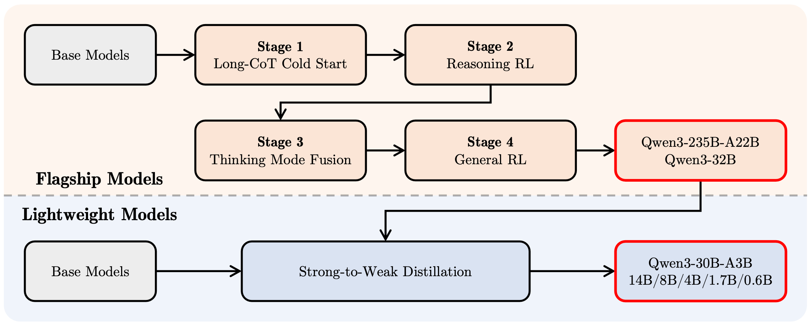

# Qwen3

## Abstract

1. **Qwen3模型概述**  
   - **模型系列**：包含Dense模型和Mixture-of-Expert (MoE)架构模型，参数规模从0.6亿至2350亿。  
   - **核心创新**：首次将thinking模式（复杂多步推理）与non-thinking模式（快速上下文响应）整合至统一框架，无需切换不同模型。  

2. **关键技术设计**  
   - **动态模式切换**：根据user queries或者chat templates自动切换推理模式。  
   - **思维预算机制**：允许用户自适应分配计算资源，动态平衡任务复杂度下的延迟与性能。  

3. **资源优化策略**  
   - **知识迁移**：通过旗舰模型的知识压缩技术，显著降低小规模模型的计算资源需求，同时保持高性能。  

4. **性能评估与成果**  
   - **基准测试**：在代码生成、数学推理、智能体任务等多领域达到SOTA，与更大规模MoE模型和闭源模型竞争。  
   - **多语言扩展**：支持语言从29种增至119种，提升跨语言理解与生成能力。  

## Introduction

1. **AGI/ASI与大模型发展背景**
   - **近期突破**：
     1. 大规模基础模型（如GPT-4o、Claude 3.7、Gemini 2.5、Llama-4、Qwen2.5）通过万亿级token训练，整合人类知识与能力。
     2. 基于强化学习的推理模型（如o3、DeepSeek-R1）提升inference-time scaling与智能水平。
   - **开源趋势**：开源社区快速缩小开源模型与闭源模型性能差距，顶级模型（如Meta-AI 2025、DeepSeek-V3、Qwen2.5）逐步开放。

2. **Qwen3模型体系**
   - **定位与特性**：通义千问系列最新开源大语言模型（LLMs），在多领域任务实现SOTA性能。
   - **参数规模与架构**：
     1. **参数范围**：0.6B至235B，覆盖不同下游需求。
     2. **MoE设计**：旗舰模型Qwen3-235B-A22B采用混合专家架构，总参数2350亿，每token激活220亿参数（$235B_{total}, 22B_{activated/token}$）。
     3. **性能平衡**：通过架构设计兼顾高性能与高效推理。

3. **模型架构改进**
   - **双模式集成（Dual-Mode Integration）**：  
     1. 支持`thinking mode`与`non-thinking mode`无缝切换。  
     2. 提供`thinking budgets`机制，允许用户控制模型推理时的计算资源分配，优化复杂任务的执行效率。  
   - **多语言能力增强**：  
     1. 基于36T token的多语言预训练，覆盖119种语言及方言。

4. **Pre-training**
   - **数据构建**：  
     1. 多模态扩展：通过Qwen2.5-VL（Bai et al., 2025）从PDF文档抽取文本，结合领域专用模型生成合成数据（Qwen2.5-Math、Qwen2.5-Coder）。  
   - **三阶段训练策略**：  
     1. 第一阶段：30T token训练通用知识基础。  
     2. 第二阶段：强化STEM与编程领域的深度推理能力。  
     3. 第三阶段：长上下文训练（max context length从4k扩展至32k tokens）。

5. **Post-Training**
   - **多阶段协同优化**：  
     1. **前两阶段**：基于长链思维链（CoT）冷启动微调与强化学习，专攻数学与编程任务。  
     2. **后两阶段**：融合含/不含推理路径的数据统一微调，结合通用领域强化学习提升下游任务性能。  
   - **小模型蒸馏（Strong-to-Weak Distillation）**：  
     1. 通过离策略/在线策略知识迁移，从大模型蒸馏小模型，显著优于传统强化学习效果。

## Architecture

1. **模型系列概述**
   - **Dense模型**：包含6个规模，Qwen3-0.6B, Qwen3-1.7B, Qwen3-4B, Qwen3-8B, Qwen3-14B, Qwen3-32B
   - **MoE模型**：
     1. Qwen3-30B-A3B：总参数30B，激活参数3B。
     2. Qwen3-235B-A22B：总参数235B，激活参数22B。
2. **架构细节**
   - **密集模型架构**：
     1. **基础设计**：继承Qwen2.5架构，包含：
        - Grouped Query Attention (GQA)
        - SwiGLU
        - RoPE
        - RMSNorm & pre-normalization
     2. **改进点**：
        - 移除QKV-bias（Qwen2中使用）
        - 引入QK-Norm优化注意力机制稳定性
   - **MoE模型架构**：
     1. **基础架构**：与Dense模型共享相同核心设计。
     2. **专家配置**：
        - 总专家数：128
        - 每token激活专家数：8
     3. **创新设计**：
        - 细粒度专家分割
        - 移除共享专家（区别于Qwen2.5-MoE）
        - 采用global-batch load balancing loss促进专家专业化
     4. **效果**：显著提升下游任务性能。
3. **Tokenizer**
   - **基础实现**：使用Qwen的tokenizer，基于字节级字节对编码（BBPE）。
   - **词表大小**：151,669。

Qwen3 Dense model

| Models     | Layers | Heads (Q / KV) | Tie Embedding | Context Length |
| ---------- | ------ | -------------- | ------------- | -------------- |
| Qwen3-0.6B | 28     | 16 / 8         | Yes           | 32K            |
| Qwen3-1.7B | 28     | 16 / 8         | Yes           | 32K            |
| Qwen3-4B   | 36     | 32 / 8         | Yes           | 128K           |
| Qwen3-8B   | 36     | 32 / 8         | No            | 128K           |
| Qwen3-14B  | 40     | 40 / 8         | No            | 128K           |
| Qwen3-32B  | 64     | 64 / 8         | No            | 128K           |

Qwen3 MoE model

| Models          | Layers | Heads (Q / KV) | # Experts (Total / Activated) | Context Length |
| --------------- | ------ | -------------- | ----------------------------- | -------------- |
| Qwen3-30B-A3B   | 48     | 32 / 4         | 128 / 8                       | 128K           |
| Qwen3-235B-A22B | 94     | 64 / 4         | 128 / 8                       | 128K           |

## Pre-training

### Pre-training Data

1. **数据规模与多样性扩展**
   - **预训练数据扩展**：
     1. 数据量：收集的预训练token数量为Qwen2.5的两倍，总token数达36T。
     2. 语言覆盖：支持语言从29种扩展至119种，涵盖方言及多语言文本。
     3. 数据集构成：包含编程、STEM、推理任务、书籍、合成数据等多领域高质量内容。
   - **数据扩展方法**：
     1. **多模态文本获取与优化**：  
        - 使用Qwen2.5-VL模型对PDF类文档进行文本识别，再通过Qwen2.5模型优化文本质量，新增数万亿高质量token。
     2. **合成数据生成**：  
        - 调用Qwen2.5-Math、Qwen2.5-Coder等模型生成教科书、问答对、指令、代码片段等格式的合成数据，覆盖数十领域。
     3. **多语言扩展**：  
        - 引入更多语言数据，语言总数从29增至119，提升跨语言能力。

2. **多语言数据标注系统**
   - **系统设计与应用**：  
     - 开发多维度标注系统，标注超30万亿token，涵盖教育价值、领域、安全性等维度，支持精细化数据筛选与组合。
   - **数据混合优化方法**：  
     - **实例级优化**：与传统数据源/领域级优化不同，通过小规模代理模型的消融实验，基于细粒度标签在实例级别调整数据混合策略。  
     - **优势**：相比Xie et al. (2023)、Fan et al. (2023)等方法，实现更灵活的数据分布控制。

### Pre-training Stage

1. **预训练三阶段架构**
   - **General Stage（S1）**  
     - 处理30万亿token数据集  
     - 序列长度：4k tokens  
     - 覆盖语言：119种语言及方言  
     - 目标：语言能力与通用知识基础构建  
   - **Reasoning Stage（S2）**  
     - 优化数据构成：增加STEM、编程、推理与合成数据占比  
     - 进一步预训练：5万亿高质量tokens  
     - 学习率策略：加速衰减机制  
     - 序列长度：4k tokens  
   - **Long Context Stage（S3）**  
     - 数据规模：数百亿至千亿tokens  
     - 序列长度：32k tokens  
     - 数据分布：
       1. 75%文本长度16k-32k tokens  
       2. 25%文本长度4k-16k tokens  
     - 关键技术：  
       - RoPE频率扩展：$10^4 \rightarrow 10^6$（ABF技术）  
       - YARN
       - Dual Chunk Attention（DCA）  
       - 推理阶段序列容量提升4倍  

2. **Scaling laws for hyper-parameters**  
   - 基于三阶段预测最优超参数  
   - 研究维度：  
     - 模型架构  
     - 训练数据特性  
     - 训练阶段划分  
     - 超参数关系  
   - 为每个dense/MoE模型设定learning rate与batch策略

## Post-training

1. **核心目标**  
   - **Thinking Control**  
     - 支持两种模式：`non-thinking`（非思维）与`thinking`（思维）模式  
     - 通过指定token预算（token budget）控制推理深度  
   - **Strong-to-Weak Distillation**  
     - 优化轻量级模型的后训练流程  
     - 利用大规模模型知识降低计算成本与开发难度  

2. **四阶段训练流程**  
   - **阶段1-2**：聚焦模型`thinking`能力开发（推理能力培养）  
   - **阶段3-4**：集成强`non-thinking`功能（直接响应能力）  

3. **强到弱蒸馏方法（Distillation Approach）**  
   - **核心策略**：从教师模型蒸馏输出`logits`至轻量级学生模型  
   - **优势**：  
     1. **性能提升**：$\text{Pass@1}$（单次通过率）与$\text{Pass@64}$（多次探索通过率）显著优化  
     2. **训练效率**：仅需$1/10$传统四阶段训练的GPU小时数  
     3. **流程简化**：无需对每个小模型独立执行完整四阶段训练

### Long-CoT Cold Start

1. **数据集构建（Dataset Construction）**  
   - **覆盖范围**：涵盖数学、代码、逻辑推理和通用STEM问题，每道题配验证过的参考答案或代码测试用例，作为long-CoT训练"冷启动"阶段的基础。  
   - **两阶段过滤流程**：  
     1. **查询过滤（Query Filtering）**：  
        - 使用Qwen2.5-72B-Instruct移除不可验证问题（如多子问题或纯文本生成任务）。  
        - 排除无需CoT即可正确解答的简单问题，防止模型依赖浅层猜测。  
        - 通过Qwen2.5-72B-Instruct标注领域标签，确保数据集领域分布均衡。  
     2. **响应过滤（Response Filtering）**：  
        - 对剩余查询用QwQ-32B生成N个候选响应，失败时由人工标注验证准确性。  
        - 对Pass@N>0的查询应用严格过滤规则，剔除：  
          (1) 最终答案错误；  
          (2) 内容大量重复；  
          (3) 明显猜测行为缺乏合理推理；  
          (4) 思考过程与结论矛盾；  
          (5) 混合不当语言或风格突变；  
          (6) 与验证集条目高度相似。  

2. **冷启动训练阶段（Cold Start Training Phase）**  
   - **核心目标**：在强化学习（RL）前建立基础推理模式，避免过度强调即时性能限制模型潜力。  
   - **训练策略**：  
     - 仅使用精炼后的数据子集进行初始化训练。  
     - 最小化训练样本数量和训练步数，保留模型灵活性以适应后续RL优化。

### Reasoning RL

1. **查询验证器对（Query-Verifier Pairs）的选择标准**
   - **标准要求**：
     1. 未在冷启动阶段使用；
     2. 可被冷启动模型学习；
     3. 尽可能具有挑战性；
     4. 覆盖广泛的子领域。
   - **数据规模**：共收集3,995组查询验证器对。

2. **训练方法与优化策略**
   - **算法选择**：采用GRPO更新模型参数。
   - **训练效率优化**：
     1. 使用大batch size和高rollouts数量；
     2. 结合off-policy training提升样本效率。
   - **探索与利用的平衡**：通过控制模型熵值（entropy）使其稳定增长或维持稳定，保障训练稳定性。

3. **训练效果与验证**
   - **性能提升**：单次RL训练过程中，训练奖励和验证性能持续优化，无需人工调整超参数。
   - **量化结果**：Qwen3-235B-A22B模型在AIME’24评分中，分数从70.1提升至85.1（共170步RL训练）。

### Thinking Mode Fusion

1. **思考模式融合（Thinking Mode Fusion）**  
   - **核心目标**：整合"非思考"能力到已有"思考"模型中，实现推理控制与部署成本优化。  
   - **关键优势**：支持动态切换思考模式，降低多模型部署复杂性，提升低资源语言任务表现。  

2. **SFT数据构建**  
   - **数据组成**：混合"思考"与"非思考"数据，通过拒绝采样（rejection sampling）生成Stage 2模型的高质量思考数据。  
   - **非思考数据设计**：  
     1. 覆盖任务类型：编程、数学、指令跟随、多语言、创意写作、问答、角色扮演。  
     2. 质量评估：自动生成检查清单（checklists）。  
     3. 低资源语言优化：增加翻译任务比例以增强表现。  
   - **性能保障**：通过拒绝采样确保Stage 2模型性能不因SFT退化。  

3. **Chat Template**  
   - **模式控制**：引入`/think`与`/no_think`标志符，实现用户指令与模型响应模式的动态绑定。  
   - **格式一致性**：非思考模式保留空思考块（empty thinking block），确保输出结构统一并支持强制禁用思考。  
   - **默认模式**：模型默认运行思考模式，训练样本中隐含无标志符的思考模式指令。  
   - **多轮对话处理**：随机插入多标志符，响应遵循最后一次标志符指令。  

4. **思考预算（Thinking Budget）**  
   - **中间案例处理**：模型自发形成基于不完整推理生成响应的能力，支持渐进式思考控制。  
   - **停止机制**：当推理长度达用户定义阈值时，插入停止指令：  
     `Considering the limited time by the user, I have to give the solution based on the thinking directly now.\n</think>.\n\n`  
   - **自然涌现能力**：预算控制能力无需显式训练，通过Thinking Mode Fusion自然获得。

### General RL

- **目标**：全面提升模型在多样化场景中的能力与稳定性，覆盖20+定制化评分标准的任务。
- **核心能力提升方向**：
  1. **指令遵循（Instruction Following）**：确保模型准确解析用户指令，涵盖内容、格式、长度及结构化输出要求。
  2. **格式遵循（Format Following）**：强制模型响应特定标志（如`/think`与`/no think`）并规范输出标记（如使用`</think>`分隔推理与结果）。
  3. **偏好对齐（Preference Alignment）**：优化开放式问题的响应质量，提升帮助性、互动性与风格自然度。
  4. **智能体能力（Agent Ability）**：训练模型通过指定接口调用工具，通过多轮环境交互反馈提升长周期决策稳定性。
  5. **特定场景能力（Specialized Scenarios）**：针对如检索增强生成（RAG）设计任务，通过奖励信号降低幻觉风险，确保响应准确性。
- **奖励类型**：
  1. **Rule-based Reward**：
     - 应用场景：指令遵循、格式验证。
     - 优势：高精度评估输出正确性，防止reward hacking。
  2. **Model-based Reward with Reference Answer**：
     - 方法：由Qwen2.5-72B-Instruct根据预设参考答案评分。
     - 优势：灵活处理非严格格式任务，避免纯规则奖励的假阴性问题。
  3. **Model-based Reward without Reference Answer**：
     - 方法：基于人类偏好数据训练奖励模型，输出标量评分。
     - 优势：覆盖广泛查询类型，增强互动性与帮助性。

### Strong-to-Weak Distillation

1. **Strong-to-Weak Distillation流水线概述**  
   - **优化目标**：针对轻量级模型（5个密集模型：Qwen3-0.6B, 1.7B, 4B, 8B, 14B；1个MoE模型：Qwen3-30B-A3B）。  
   - **核心优势**：提升模型性能并赋予**鲁棒的模式切换能力**（robust mode-switching capabilities）。  

2. **离线策略蒸馏（Off-policy Distillation）**  
   - **目标**：培养学生模型的基础推理能力与模式切换能力，为后续在线训练阶段奠定基础。  
   - **方法**：结合教师模型在`/think`和`/no_think`模式下的输出进行响应蒸馏。  

3. **在线策略蒸馏（On-policy Distillation）**  
   - **生成过程**：学生模型基于采样提示生成在线策略响应（`/think`或`/no think`模式）。  
   - **微调策略**：通过**对齐学生模型与教师模型（Qwen3-32B或Qwen3-235B-A22B）的logits**，最小化KL散度：$\min \text{KL}(p_{\text{teacher}} \| p_{\text{student}})$  
   - **作用**：进一步优化模型在特定策略下的输出质量。