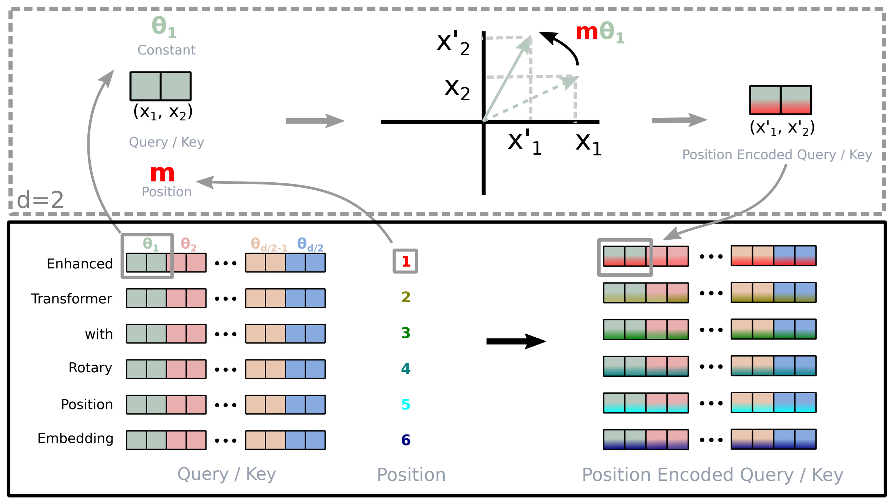

# RoFormer: Enhanced Transformer with Rotary Position Embedding

https://arxiv.org/pdf/2104.09864

https://spaces.ac.cn/archives/8265

## Introduction

1. **研究背景与动机**  
   - **序列顺序的重要性**：自然语言理解依赖词序建模。  
   - **传统模型对比**：  
     1. RNN通过时序隐状态编码位置信息。  
     2. CNN通过填充操作隐式学习位置信息。  
     3. Transformer基于自注意力机制（self-attention）实现上下文建模并行化，但原始架构为位置无关（position-agnostic）。  
   - **问题定义**：现有位置编码方法（绝对/相对位置编码）无法兼容线性自注意力（linear self-attention）架构。
2. **现有位置编码方法分析**  
   - **绝对位置编码**：  
     1. 静态函数生成（如Vaswani等，2017）。  
     2. 可学习编码（如Gehring等，2017；Devlin等，2019）。  
   - **相对位置编码**：  
     1. 将相对位置信息嵌入注意力机制（如Shaw等，2018；Dai等，2019）。  
   - **局限性**：上述方法均通过直接叠加位置编码至上下文表示，导致其难以适配线性自注意力架构。
3. **Rotary Position Embedding (RoPE)**  
   - **核心思想**：  
     1. **理论基础**：通过旋转矩阵$R(\theta) = \begin{bmatrix} \cos\theta & -\sin\theta \\ \sin\theta & \cos\theta \end{bmatrix}$对上下文表示进行绝对位置编码。  
     2. **相对位置建模**：在自注意力公式中显式引入相对位置依赖。  
   - **优势特性**：  
     1. **序列长度灵活性**：支持变长输入。  
     2. **衰减依赖**：token间相关性随相对距离增加而衰减。  
     3. **兼容性**：首次实现线性自注意力与相对位置编码的结合。

## Background and Related Work

设输入序列为 $\mathbb{S}_N = \{w_i\}_{i=1}^N$，其中 $w_i$ 表示第 $i$ 个词。对应的词向量表示为 $\mathbb{E}_N = \{\boldsymbol{x}_i\}_{i=1}^N$，其中 $\boldsymbol{x}_i \in \mathbb{R}^d$ 是不包含位置信息的词嵌入。

自注意力机制首先将位置信息加入词向量，并将其映射为查询、键和值向量：

$$
\begin{aligned}
\boldsymbol{q}_m &= f_q(\boldsymbol{x}_m, m) \\
\boldsymbol{k}_n &= f_k(\boldsymbol{x}_n, n) \\
\boldsymbol{v}_n &= f_v(\boldsymbol{x}_n, n)
\end{aligned}
\tag{1}
$$

接着通过查询和键计算注意力权重，再以加权方式聚合值向量得到输出：

$$
\begin{aligned}
a_{m,n} &= \frac{\exp\left(\frac{\boldsymbol{q}_m^\top \boldsymbol{k}_n}{\sqrt{d}}\right)}{\sum_{j=1}^N \exp\left(\frac{\boldsymbol{q}_m^\top \boldsymbol{k}_j}{\sqrt{d}}\right)} \\
\boldsymbol{o}_m &= \sum_{n=1}^N a_{m,n} \boldsymbol{v}_n
\end{aligned}
\tag{2}
$$

Transformer 中的位置编码方法主要集中在选择合适的映射$f$。

## RoPE

在Transformer中，自注意力机制通过**查询（Query）和键（Key）的内积**计算token之间的相关性。但原始的内积无法直接捕捉**相对位置信息**（例如"king - man + woman = queen"的类比关系）。因此，我们需要设计一种位置编码方法，使得：
$$
\langle f_q(x_m, m), f_k(x_n, n) \rangle = g(x_m, x_n, m-n)
$$
即查询和键的内积结果仅依赖于词向量$x_m, x_n$和它们的**相对位置差$m-n$**。



RoPE通过**旋转词向量**来编码位置信息。具体来说：
- 将词向量$x$转换为复数形式；
- 对不同位置的向量施加不同角度的旋转；
- 旋转后的向量内积会自然包含位置差的信息。

以最简单的二维向量为例（$d=2$），假设词向量$x = (x_1, x_2)$，我们可以将其视为复数$z = x_1 + x_2 i$。

### 定义旋转函数

定义查询和键的旋转函数：
$$
f_q(x, m) = (W_q x) \cdot e^{i m \theta} \\
f_k(x, n) = (W_k x) \cdot e^{i n \theta}
$$
其中：
- $W_q, W_k$是可学习的权重矩阵；
- $\theta$是预设的非零常数（控制旋转频率）；
- $e^{i m \theta}$表示将向量旋转$m\theta$弧度。

### 计算内积

将两个旋转后的向量做内积：
$$
\langle f_q(x_m, m), f_k(x_n, n) \rangle = \text{Re}\left[ (W_q x_m) \cdot \overline{(W_k x_n)} \cdot e^{i(m-n)\theta} \right]
$$
其中：
- $\overline{(W_k x_n)}$表示取复数共轭；
- $\text{Re}[\cdot]$表示取实部。

我们发现：

- 旋转角度差$(m-n)\theta$被编码到指数项中；
- 内积结果的实部自动包含了位置差$m-n$的信息。

### 推广到高维

对于更高维的向量（如$d=64$），我们将向量拆分为多个二维平面，在每个平面上独立应用旋转：
$$
\begin{align}
f_{\{q, k\}}\left(\boldsymbol{x}_{m}, m\right) & = \boldsymbol{R}_{\Theta, m}^{d} \boldsymbol{W}_{\{q, k\}} \boldsymbol{x}_{m}
\end{align}
$$
旋转矩阵$\boldsymbol{R}_{\Theta, m}^{d}$的形式为：
$$
\begin{align}
\boldsymbol{R}_{\Theta, m}^{d} & = \left(\begin{array}{ccccccc}
\cos m \theta_{1} & -\sin m \theta_{1} & 0 & 0 & \cdots & 0 & 0 \\
\sin m \theta_{1} & \cos m \theta_{1} & 0 & 0 & \cdots & 0 & 0 \\
0 & 0 & \cos m \theta_{2} & -\sin m \theta_{2} & \cdots & 0 & 0 \\
0 & 0 & \sin m \theta_{2} & \cos m \theta_{2} & \cdots & 0 & 0 \\
\vdots & \vdots & \vdots & \vdots & \ddots & \vdots & \vdots \\
0 & 0 & 0 & 0 & \cdots & \cos m \theta_{d / 2} & -\sin m \theta_{d / 2} \\
0 & 0 & 0 & 0 & \cdots & \sin m \theta_{d / 2} & \cos m \theta_{d / 2}
\end{array}\right)
\end{align}
$$
每个二维子空间的旋转角度相同，但频率$\theta$按不同比例设置。原始论文中 $\theta_i=10000^{-2i/d}$。

高效计算：
$$
\begin{align}
\boldsymbol{R}_{\Theta, m}^{d} \boldsymbol{x} & = \left(\begin{array}{c}
x_{1} \\
x_{2} \\
x_{3} \\
x_{4} \\
\vdots \\
x_{d-1} \\
x_{d}
\end{array}\right) \otimes\left(\begin{array}{c}
\cos m \theta_{1} \\
\cos m \theta_{1} \\
\cos m \theta_{2} \\
\cos m \theta_{2} \\
\vdots \\
\cos m \theta_{d / 2} \\
\cos m \theta_{d / 2}
\end{array}\right)+\left(\begin{array}{c}
-x_{2} \\
x_{1} \\
-x_{4} \\
x_{3} \\
\vdots \\
-x_{d} \\
x_{d-1}
\end{array}\right) \otimes\left(\begin{array}{c}
\sin m \theta_{1} \\
\sin m \theta_{1} \\
\sin m \theta_{2} \\
\sin m \theta_{2} \\
\vdots \\
\sin m \theta_{d / 2} \\
\sin m \theta_{d / 2}
\end{array}\right)
\end{align}
$$

### 示例
假设词向量$x = [1, 0]^T$，位置$m=2$，旋转角度$\theta=π/4$：
$$
R(2\theta) = 
\begin{pmatrix}
\cos(π/2) & -\sin(π/2) \\
\sin(π/2) & \cos(π/2) \\
\end{pmatrix}
=
\begin{pmatrix}
0 & -1 \\
1 & 0 \\
\end{pmatrix}
$$
旋转后的向量为：
$$
f_q(x, 2) = R(2\theta) \cdot x = 
\begin{pmatrix}
0 & -1 \\
1 & 0 \\
\end{pmatrix}
\cdot
\begin{pmatrix}
1 \\
0 \\
\end{pmatrix}
=
\begin{pmatrix}
0 \\
1 \\
\end{pmatrix}
$$

## 代码实现

### 预计算频率

```python
def precompute_freqs_cis(dim: int, end: int, theta: float = 10000.0):
    # 计算基频 θ_i = 1 / (θ^(2i/dim)), i=0,1,...,dim/2-1
    freqs = 1.0 / (theta ** (torch.arange(0, dim, 2)[: (dim // 2)].float() / dim))
    # [dim/2]: [θ_1, θ_2, ..., θ_{dim/2}]
    
    # 时间步 t ∈ [0, end)
    t = torch.arange(end, device=freqs.device, dtype=torch.float32)
    # [max_seq_len]: [0, 1, 2, ..., max_seq_len - 1]
    
    # 计算 t * θ_i，得到每个位置 m 的角度
    freqs = torch.outer(t, freqs)
    # [max_seq_len, dim / 2]: (i, j) -> (i * θ_j)
    
    # 转换为复数形式 cis(mθ_i) = cos(mθ_i) + i sin(mθ_i)
    freqs_cis = torch.polar(torch.ones_like(freqs), freqs)
    # [max_seq_len, dim / 2] dtype: complex64
    return freqs_cis
```

`torch.outer`计算两个一维向量的外积，输入`vec_1`和`vec_2`，输出$C$形状为`len(vec_1), len(vec_2)`：
$$
C_{i,j}=a_i\times b_j
$$
`torch.polar`将极坐标（幅度和角度）转换为复数形式的笛卡尔坐标。

**输入参数**：

  - `abs` (Tensor): 极坐标的幅度（模长）$r$，必须为非负数。
  - `angle` (Tensor): 极坐标的角度（弧度）$\theta$。

**返回**：复数形式的张量（`dtype` 为 `torch.complex64` 或 `torch.complex128`）。
$$
z = r \cdot (\cos \theta + i \sin \theta) = r \cdot e^{i\theta}
$$

### 应用旋转位置编码

```python
class Transformer:
    ...
    self.freqs_cis = precompute_freqs_cis(
        params.dim // params.n_heads,
        params.max_seq_len * 2,
        params.rope_theta,
    )

def apply_rotary_emb(
    xq: torch.Tensor,
    xk: torch.Tensor,
    freqs_cis: torch.Tensor,
) -> Tuple[torch.Tensor, torch.Tensor]:
  	# 输入形状：[batch_size, seq_len, n_head, head_dim]
    # 先把最后一维head_dim拆解成实部和虚部
    # 再将其转成复数形式
    xq_ = torch.view_as_complex(xq.float().reshape(*xq.shape[:-1], -1, 2))
    xk_ = torch.view_as_complex(xk.float().reshape(*xk.shape[:-1], -1, 2))
    # [batch_size, seq_len, n_head, 1, head_dim/2]
    
    # 调整频率张量形状以支持广播
    freqs_cis = reshape_for_broadcast(freqs_cis, xq_)
    # [1, seq_len, 1, 1, head_dim/2]
    
    # 复数乘法实现旋转：(a + ib) * (cosθ + i sinθ) = (a cosθ - b sinθ) + i(a sinθ + b cosθ)
    xq_out = torch.view_as_real(xq_ * freqs_cis).flatten(3)
    xk_out = torch.view_as_real(xk_ * freqs_cis).flatten(3)
    return xq_out.type_as(xq), xk_out.type_as(xk)
```

`torch.view_as_complex`将输入的实数张量转换为复数形式。

1. **输入张量的最后一维必须为 2**：
   - 输入张量的最后一维的两个值会被解释为一个复数，第一个值为实部，第二个值为虚部。
   - 例如，如果输入是 `(..., 2)`，输出会是 `(...,)`，其中每个元素是一个复数。

2. **输入张量的数据类型**：
   - 支持 `float32` 或 `float64`（即 `torch.float` 或 `torch.double`）。
   - 返回的复数张量的数据类型是 `torch.complex64` 或 `torch.complex128`，与输入的浮点类型对应。

3. **不复制数据**：
   - 返回的复数张量与输入张量**共享存储空间**，修改其中一个会影响另一个。

它与`torch.view_as_real`互为逆操作。

辅助函数`reshape_for_broadcast`用于将预计算的频率矩阵的形状中插入适当的$1$维，以便于后续进行广播计算。

```python
def reshape_for_broadcast(freqs_cis: torch.Tensor, x: torch.Tensor):
    ndim = x.ndim
    assert 0 <= 1 < ndim
    assert freqs_cis.shape == (x.shape[1], x.shape[-1]) # [seq_len, head_dim/2]
    shape = [d if i == 1 or i == ndim - 1 else 1 for i, d in enumerate(x.shape)]
    return freqs_cis.view(*shape) # [1, seq_len, 1, 1, head_dim/2]
```

复数相乘第一项：
$$
(x_1+ix_2)*(\cos\theta_1+i\sin\theta_1)=(x_1\cos\theta_1-x_2\sin\theta_1)+i(x_2\cos\theta_1+x_1\sin\theta_1)
$$
再通过`view_as_real`分解实部和虚部，正好就是所需要的前两项。